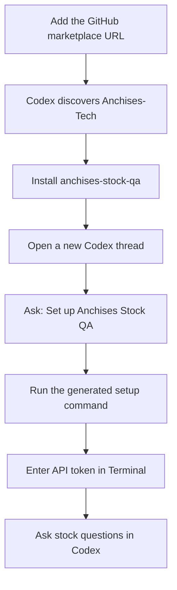
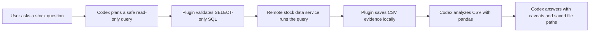
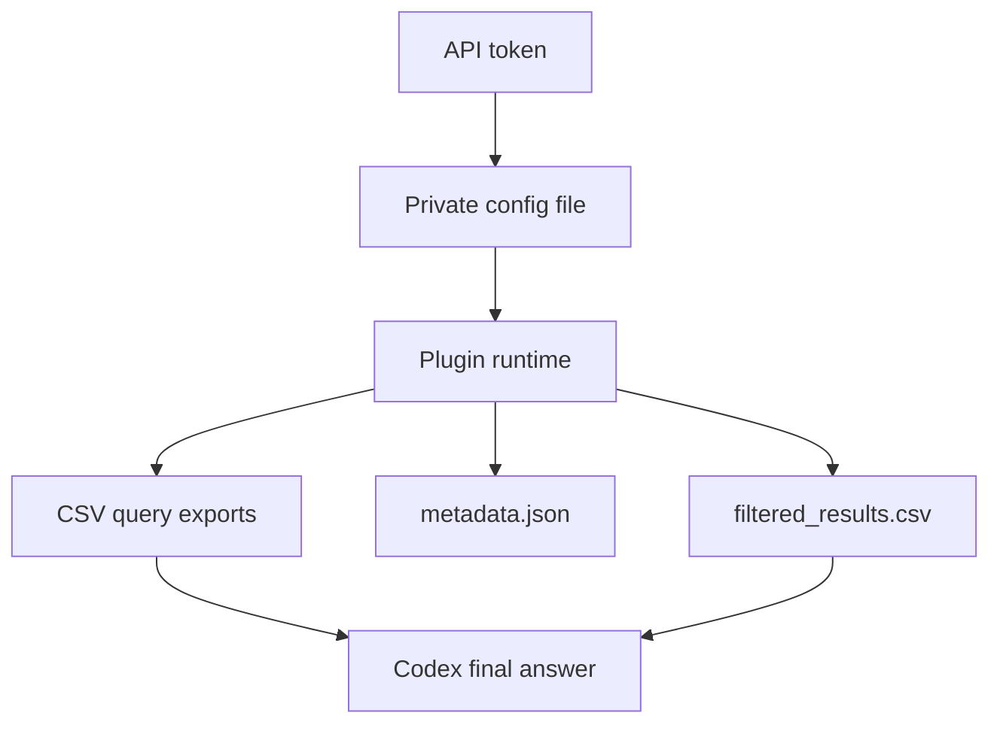
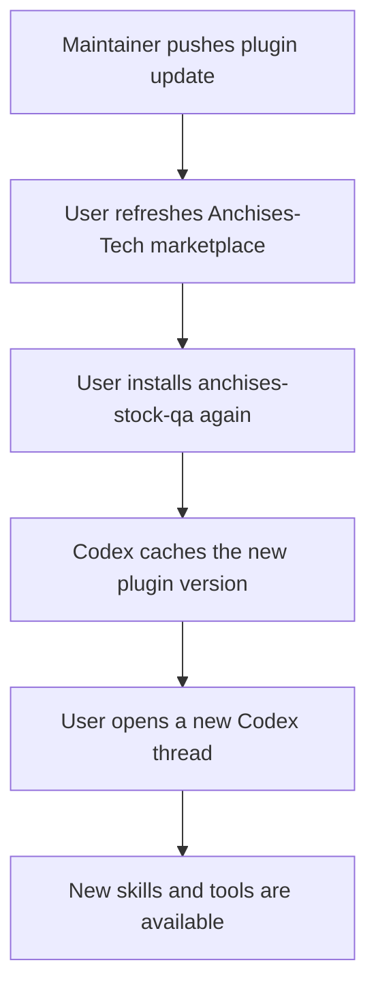

# Anchises Stock QA Marketplace


This repository is a Codex marketplace root for the **Anchises Stock QA**
plugin. Its marketplace manifest lives at
`.agents/plugins/marketplace.json` and points to the plugin package at
`plugins/anchises-stock-qa`.

Anchises Stock QA lets Codex answer stock-market questions from the Anchises
Stock QA API. Codex writes safe read-only SQL, the plugin exports CSV evidence,
and Codex analyzes the CSV with pandas before answering.

Users do not need a database URL. Access is provided through a personal API
token.

## Quick Start

```bash
codex plugin marketplace add https://github.com/2026Allin/anchises-stock-qa
codex plugin add anchises-stock-qa@Anchises-Tech
```

Then open a new Codex thread and ask:

```text
Set up Anchises Stock QA
```

Codex will show a Terminal command that matches your installed plugin path. Run
that command and enter your API token when prompted.

## What You Need

- Codex with plugin support.
- Python 3 on your machine.
- Your Anchises Stock QA API token.

## Installation Flow



You can install from the Codex app by adding this repository URL as a
marketplace URL, then installing **Anchises Stock QA** from the
**Anchises-Tech** marketplace.

If you prefer the CLI:

```bash
codex plugin marketplace add https://github.com/2026Allin/anchises-stock-qa
codex plugin add anchises-stock-qa@Anchises-Tech
```

After installing or updating, open a new Codex thread so Codex can load the
latest plugin tools and instructions.

## Configure Access

The easiest setup path is to ask Codex:

```text
Set up Anchises Stock QA
```

Codex will return a command like this:

```bash
bash "/Users/you/.codex/plugins/cache/.../anchises-stock-qa/.../scripts/init_config.sh" --prepare-runtime
```

Run that command in Terminal. The script asks for your API token and hides it
while you type. The first run may take a few minutes because it prepares the
plugin Python runtime and installs dependencies such as pandas into the plugin
`.venv`.

The config is saved here:

```text
~/.config/anchises-stock-qa/config.toml
```

Keep this file private because it contains your API token.

## Runtime Flow



The plugin discovers available exchanges from the remote data service, so new
exchanges can be added without editing prompt files.

## Check That It Works

In Codex, ask:

```text
Check the Anchises Stock QA connection.
```

You can also run this from the plugin folder:

```bash
cd plugins/anchises-stock-qa
python3 scripts/ask_stock.py --verify-db
```

## How To Use It

Ask stock questions naturally in Codex, for example:

```text
Find the strongest momentum stocks from the latest data.
```

```text
Which mining stocks had unusual volume recently?
```

```text
Show the best performers over the past month.
```

## Outputs And Local Files



Query results are saved as CSV files under the output directory in your config.
By default:

```text
~/.local/share/anchises-stock-qa/outputs
```

Old output folders are cleaned automatically when the plugin runs. By default,
cleanup checks once every 7 days and removes plugin-generated runs older than 30
days.

## Example Config

```toml
[backend]
mode = "remote_api"
api_token = "paste_your_api_token_here"

[database]
url = ""
access_mode = "readonly"

[outputs]
dir = "~/.local/share/anchises-stock-qa/outputs"
cleanup_enabled = true
cleanup_interval_days = 7
retention_days = 30

[prompts]
override_dir = ""

[exchanges.aliases]
# Optional aliases for exchange codes discovered from database table names.
# "London" = "lse"
```

You normally only need to fill in `api_token`.

## Updating Or Reinstalling



If you already added the marketplace URL, you do not need to add it again. Use:

```bash
codex plugin marketplace upgrade Anchises-Tech
codex plugin add anchises-stock-qa@Anchises-Tech
```

Your local config file is not part of the plugin install. Updating, removing, or
reinstalling the plugin will not delete:

```text
~/.config/anchises-stock-qa/config.toml
```

You only need to configure again if you delete that file or receive a new API
token.

## Custom Prompts

You can override the built-in prompts without editing the plugin:

```bash
mkdir -p ~/.config/anchises-stock-qa/prompts
cp plugins/anchises-stock-qa/prompts/*.md ~/.config/anchises-stock-qa/prompts/
```

Then set this in `config.toml`:

```toml
[prompts]
override_dir = "~/.config/anchises-stock-qa/prompts"
```

You only need to copy the prompt files you want to customize. Missing files fall
back to the plugin defaults.

## Repository Layout

```text
.agents/plugins/marketplace.json
plugins/anchises-stock-qa/
  .codex-plugin/plugin.json
  .mcp.json
  assets/
  mcp/
  prompts/
  scripts/
  skills/
tests/
```

## Safety

- Users do not receive the database URL.
- The plugin only accepts safe read-only queries.
- API tokens are redacted in plugin output and metadata.
- The database remains behind the remote API service.
