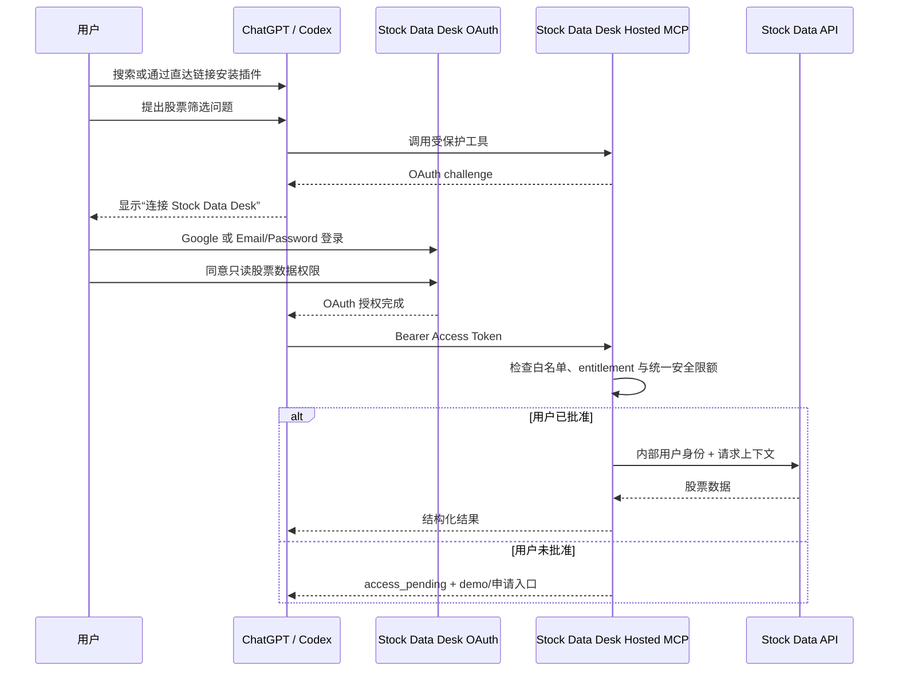
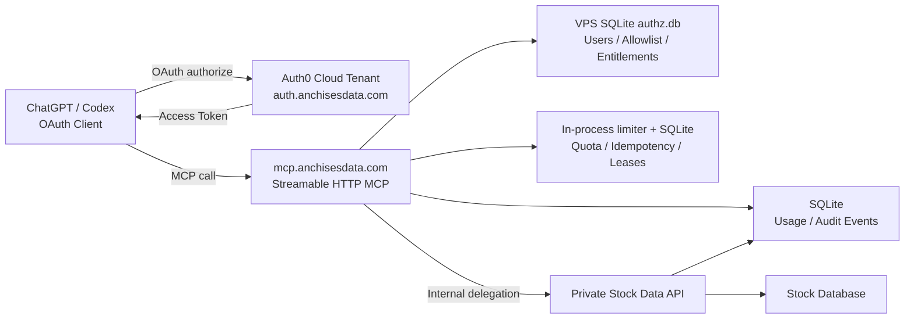
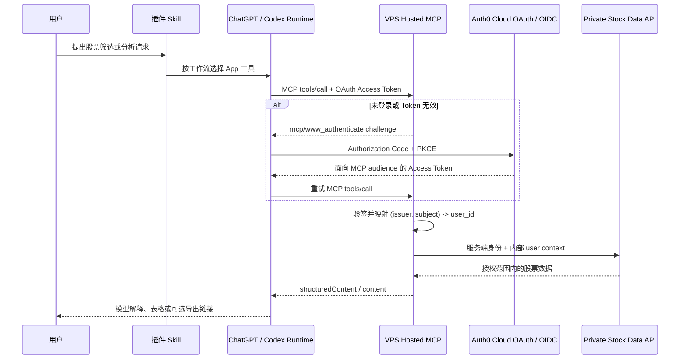

# Stock Data Desk Hosted MCP 与 OAuth 完整改造方案

> 当前发布状态（2026-07-16）：本文档保留为历史架构记录和未来 OAuth
> 规划，不再定义首个公开版本。当前发布已冻结为 `public_noauth`，用户无需
> 登录，所有 12 个生产工具使用 `noauth`，额度为共享服务容量。当前发布计划
> 以 `docs/stocks-info-marketplace-release-plan.md` 为准。本文下方涉及 Auth0、
> allowlist、pending entitlement、审核账号和 OAuth 登录的内容均属于未来版本，
> 不得复制到当前 Plugin Directory listing、Skill 或审核说明中。

- 状态：历史方案 / 未来 OAuth 规划
- 日期：2026-07-15
- 目标版本：首个可公开分发的 Plugin Directory 版本
- 实施状态：`qa-v2-auth` 已完成插件侧契约、全离线 mock 测试和 Phase 7A Developer Mode App 激活；本地 stdio MCP 与 API Token 客户端已从该分支移除。真实 Auth0 Tenant、OAuth 白名单和公开发布尚未激活

## 1. 执行摘要

本方案将 Stock Data Desk 从“Codex 本地 stdio MCP + 用户手工配置 API Token + 远程 Stock Data API”改造成：

- 一个公开的 `Stock Data Desk` 插件；
- 一个统一的 `stock-data-desk` Skill，不拆分 Work/Codex Skill；
- 一个运行在 `https://mcp.anchisesdata.com/mcp` 的 Hosted MCP；
- 一个由 Auth0 云端 Tenant 托管、目标自定义域名为 `https://auth.anchisesdata.com` 的 OAuth 2.1/OIDC 身份服务；
- Auth0 Universal Login 提供 Google 登录，以及 Email/Password 注册、登录、邮箱验证和密码重置；
- 一个放在 VPS 本地持久化磁盘上的 SQLite `authz.db`，保存 Stock Data Desk 用户映射、白名单、批准状态、权限、用量和审计；
- 由 Stock Data Desk 生成的稳定 `user_id` 作为业务用户身份；
- MCP 与 Stock Data API 全部在后端通信；
- Stock Data API 不再接受普通插件用户手工配置的长期 API Token；
- 用户通过 Plugin Directory 搜索或直达链接安装；首次使用时登录 Stock Data Desk，后台批准用户可查询真实数据，未批准用户进入 pending/demo 状态并获得申请入口。

公开首版不包含自定义 Apps SDK UI 和 Sites 发布功能。它们不是完成“搜索、安装、登录、使用”闭环的必要条件，可以在 Hosted MCP 和 OAuth 稳定后单独迭代。

实施顺序调整为“插件代码准备优先、VPS 后端独立实现、最后公开发布”。当前仓库只维护 Hosted App-only 插件包、接口契约和发布材料，不创建或维护后端源码。Phase 7A 已通过真实 `.app.json` 连接 Developer Mode App，因此该功能分支不再携带本地 stdio MCP。后端由项目方在 VPS 上另建独立目录或仓库，并从第一天起使用最终生产域名；不建设 staging 子域名。

### 1.1 开发分支与发布边界

插件端改造统一在长期功能分支 `qa-v2-auth` 中完成，该分支从当前稳定的 `main` 创建，同时承载准备改造、联调、正式 OAuth 验收和最终公开发布，不再为最终切换另建 activation 分支。

- `main` 在正式切换前继续代表当前已发布的稳定版本；已安装版本不会因功能分支删除源码而被远程修改；
- `qa-v2-auth` 只保留 Hosted App、单一 Skill、Hosted contract 和发布材料，不再维护 `.mcp.json`、`mcpServers`、Python bootstrap 或 API Token 客户端；
- 准备提交和公开发布提交仍须保持独立，以便按提交或版本回退；
- 只有 Phase 7 的生产域名、Auth0、白名单、SQLite 授权和端到端验收全部通过后，才能在 `qa-v2-auth` 中提交公开发布改动；
- Phase 8 验证通过后，以 `qa-v2-auth` 向 `main` 发起最终合并，随后再更新 GitHub marketplace 或提交 Plugin Directory；
- 当前 `anonymous_dev` Developer Mode 构建不发布给普通用户；回滚依赖 Git 提交、已发布插件版本和后端 revision，而不是在同一插件包中并存两个运行时。

## 2. 已确定的架构决策

以下决策作为后续实施默认值：

1. 只保留一个 Skill：`stock-data-desk`。
2. 普通用户不创建、不复制、不填写 Stock Data Desk API Token。
3. ChatGPT/Codex 是 OAuth 客户端，不是 Stock Data Desk 用户身份来源。
4. 用户通过 Google 或 Email/Password 注册和登录 Stock Data Desk。
5. Stock Data Desk 内部 `users.id` 是唯一业务身份；Email 不能作为主键。
6. OAuth 采用 Authorization Code + PKCE S256。
7. 身份提供商确定为 Auth0，首版从 Auth0 Free Tenant 起步；Auth0 是云服务，不安装在 VPS，也不使用 VPS SQLite 保存密码。
8. OAuth 客户端识别优先采用 Auth0 的 CIMD；若提交门户集成更适合 predefined client，则可先采用 predefined client，但不得降低 PKCE、redirect URI 和 audience 校验要求。DCR 只在确有兼容需要时开启。
9. MCP 采用 Streamable HTTP。
10. MCP 生产 origin 固定为 `https://mcp.anchisesdata.com`。
11. OAuth issuer 目标固定为 Auth0 Custom Domain `https://auth.anchisesdata.com/`；必须以 Auth0 discovery document 返回的 `issuer` 为唯一真值并保持结尾 `/` 一致。若 Free Tenant 实际不提供 Custom Domain，必须在公开发布前选择升级或冻结 Auth0 Tenant Domain，不能在 VPS 上自行反向代理伪造 issuer。
12. Stock Data API 只接受 MCP 后端的内部身份或内部委托 JWT，不直接暴露给插件客户端。
13. 用户额度按 `user_id` 统计，多端连接按 `connection_id` 区分。
14. 默认不记录原始 Prompt、完整 SQL、股票结果行或用户具体关注标的。
15. GitHub marketplace 仅作为开发/灰度渠道；Plugin Directory 是正式公开渠道。
16. 实施顺序先准备插件代码，再由项目方在 VPS 的独立目录或仓库实现后端；本插件仓库不包含后端源码。
17. 集成测试直接使用最终生产域名 `mcp.anchisesdata.com` 和 `auth.anchisesdata.com`，不使用 staging 子域名。
18. 未公开阶段通过 OAuth beta allowlist、测试账户、功能开关和部署 revision 控制访问，不通过临时域名隔离。
19. 插件改造统一在 `qa-v2-auth` 分支完成，并分成“Developer Mode 准备提交”和“公开发布提交”：前者可以先完成，后者必须等正式 OAuth 与授权验收通过；最终从该分支合并回 `main`。
20. 正式版本 Publish 到通用 Plugin Directory，允许所有用户搜索和安装。
21. 真实股票数据权限由 VPS `access_allowlist + entitlement` 控制，不由插件可见性或 OAuth 登录成功与否决定。
22. Email/Password 使用 Auth0-hosted Database Connection；Auth0 保存密码哈希并负责注册、验证和重置，VPS 与 SQLite 永不接收或保存密码、密码哈希。
23. 首版授权控制面数据库固定为 VPS 本机 SQLite，不引入 MySQL/PostgreSQL 依赖；股票业务数据继续留在现有 Stock Data API/数据库。
24. 首版不强制部署 Redis；限流、幂等、并发租约和持久用量先使用进程内控制加 SQLite 原子事务实现。
25. SQLite 只允许同一台 VPS 上的服务进程访问；数据库文件不得放在 NFS、网络卷、对象存储挂载或容器临时层。
26. 首个 Hosted MCP 版本不提供服务端自定义 Prompt 工具；插件只保留内置 Skill 指令，本地 Prompt 工具与 stdio MCP 一并移除。

## 3. 当前状态与需要解决的问题

### 3.1 当前调用链

当前功能分支的 manifest 只通过 `apps` 加载 `.app.json`：

```text
Work / ChatGPT / Codex
  -> Stock Data Desk Hosted App
  -> https://mcp.anchisesdata.com/mcp
  -> Stock Data API
```

相关文件：

- `plugins/stock-data-desk/.codex-plugin/plugin.json`
- `plugins/stock-data-desk/.app.json`
- `plugins/stock-data-desk/skills/stock-data-desk/SKILL.md`
- `plugins/stock-data-desk/contracts/hosted-mcp-v1.json`

当前 Phase 7A App 使用 `anonymous_dev` 访问模式；正式版改为 Auth0 OAuth。普通用户不配置 API Token，Hosted MCP 在后端以内部身份调用 Stock Data API。

修改本仓库中的插件代码不会自动覆盖用户已经安装的缓存版本，但会影响后续从 GitHub marketplace 新安装或主动更新的用户。因此，Hosted App-only 改动保留在 `qa-v2-auth`，等正式 OAuth 和授权验收通过后再合并和发布。

### 3.2 发布层状态

三类发布问题的当前状态：

1. **安装来源冲突**：本机曾出现 `stock-data-desk@personal` 指向 marketplace 仓库根目录，而真正插件包位于嵌套的 `plugins/stock-data-desk`。正式开发源应统一为 `stock-data-desk@Stock-Data-Desk`，公开源应统一为 Plugin Directory。
2. **产品文案冲突（已解决）**：manifest、单一 Skill 和 `agents/openai.yaml` 已统一为 Hosted App 工作流。
3. **公开发布材料（部分完成）**：website、privacy、terms、图标和审核 fixture 已进入插件包；开发者验证、截图、真实审核账号和正式 OAuth 验收仍待完成。

### 3.3 剩余能力约束

- `anonymous_dev` 仍是共享开发访问，尚不能区分或批准真实用户。
- Auth0 OAuth、SQLite entitlement、白名单和逐用户用量控制仍需由 VPS 后端实现。
- 大结果必须继续分页，CSV 必须由后端返回短期下载能力，不能回退到本地文件路径。

## 4. 目标用户体验



完成后，普通用户不需要：

- Clone GitHub 仓库；
- 安装 Python；
- 启动本地 MCP；
- 配置 MySQL；
- 编辑 TOML；
- 创建或复制 API Token；
- 理解 SQL、CSV 或 pandas。

## 5. 目标系统架构



### 5.1 Auth0、VPS 与 SQLite 的部署边界

Auth0 不安装在 VPS。项目方在 Auth0 控制台创建云端 Tenant，配置 Google Social Connection、Auth0 Database Connection、Universal Login、API Resource Server、CIMD/客户端注册和 Custom Domain。`auth.anchisesdata.com` 通过 Auth0 要求的 DNS 记录指向 Auth0 边缘服务，不由 VPS 应用自行实现 `/authorize`、`/oauth/token` 或密码存储。

VPS 只运行 Hosted MCP、Stock Data API adapter 和 Stock Data Desk 业务授权层。Hosted MCP 从 Auth0 discovery/JWKS 获取公开元数据，验证 Access Token 后，把 `(issuer, subject)` 映射为本地 `user_id`，再查询 VPS 本地 SQLite：

```text
/var/lib/anchises-stock-qa/authz.db
```

SQLite 只保存业务授权和运营数据，不保存 Auth0 密码、密码哈希、Access Token、Refresh Token、Google Client Secret 或 Auth0 Management API Token。Secret 仅放在 VPS 的受限环境变量或 Secret 管理设施中。

### 5.2 代码与部署职责边界

当前仓库只负责可以公开分发的插件包，以及插件与后端共同遵守的接口契约：

```text
docs/
  hosted-mcp-oauth-migration-plan.md
  contracts/
    hosted-mcp-tools.md
    stock-data-api.md

plugins/
  stock-data-desk/
    .codex-plugin/plugin.json
    .app.json
    skills/stock-data-desk/
    assets/
```

VPS 后端由项目方在当前工作区之外独立创建和部署，至少包括 Auth0 Token 验证、Hosted MCP、Stock Data API adapter、SQLite 授权/用量存储以及日志监控。它不属于插件安装包，也不需要把源码复制到本仓库。双方只通过以下稳定契约协作：

- `docs/contracts/hosted-mcp-tools.md`：工具名称、说明、input/output schema、annotations、错误码和版本兼容规则；
- `docs/contracts/stock-data-api.md`：MCP 后端到 Stock Data API 的内部身份、请求和响应 contract；
- 正式域名及 OAuth metadata：作为运行时发现和认证入口。

### 5.3 插件与 VPS 后端的运行时交互

插件不是 HTTP 客户端，Skill 也不直接 `curl` 或 `fetch` VPS。实际链路如下：



职责分工：

| 层 | 负责内容 | 不负责内容 |
|---|---|---|
| `SKILL.md` | 何时调用工具、调用顺序、结果解释和安全边界 | 登录页面、Token 保存、直接访问数据库 |
| `.app.json` | 开发阶段引用 ChatGPT Developer Mode 创建的 App ID | 保存 MCP 密钥、OAuth client secret 或后端代码 |
| `plugin.json` | 声明单一 Skill、App 引用、品牌和公开元数据 | 实现业务 API |
| ChatGPT/Codex runtime | 发起 MCP 调用、处理 OAuth UI、保存用户连接 | 生成 Stock Data Desk 业务用户 ID |
| VPS Hosted MCP | 工具实现、Token 验证、用户映射、权限、额度、审计 | 把内部服务凭证返回给插件 |
| Stock Data API | 数据访问、只读查询策略和结果限制 | 直接接受普通插件用户的长期 Token |

重要约束：ChatGPT/Codex 获得的 OAuth Access Token 只发送给 Hosted MCP。MCP 验证后使用内部 Delegation JWT 或服务内 `UserContext` 调用 Stock Data API，不应把外部 OAuth Token 原样转发给内部 Data API。

### 5.4 开发 App 与公开 Plugin Directory 的连接方式

开发和公开发布使用同一个 MCP origin，但连接方式不同：

1. **开发测试**：在 ChatGPT Developer Mode 中用 `https://mcp.anchisesdata.com/mcp` 创建私有 App，获得 `plugin_asdk_app...` ID；插件根目录 `.app.json` 引用该 App ID，`plugin.json` 的 `apps` 指向 `./.app.json`。
2. **插件本地验证**：从 repo marketplace 安装插件，在新任务中验证单一 Skill 能调用该 Developer Mode App。
3. **公开提交**：在 Plugin Submission Portal 选择 **With MCP**，直接填写 `https://mcp.anchisesdata.com/mcp` 并上传最终 Skill。提交时不是把已有 Developer Mode App ID 当作后端提交；平台会重新扫描正式 MCP 工具。
4. **公开安装**：审核并发布后，用户从 Plugin Directory 搜索或直达链接安装；平台负责把已发布 App 能力和 Skill 一起安装，用户首次调用时完成 OAuth。

因此插件端需要 VPS 后端提供的交付物只有：

- 可公开访问的生产 MCP URL；
- 完整 OAuth metadata 和可用登录流程；
- 稳定的工具名称、schemas、annotations 与错误 contract；
- Developer Mode 创建后的 App ID，供本地插件 `.app.json` 联调；
- 两个隔离测试用户和一个无 MFA 审核账号；
- website、support、privacy、terms 与域名验证 endpoint。

### 5.5 何时需要修改插件，何时只改 VPS

| 变化 | VPS 部署 | 插件更新 | 重新扫描/审核 |
|---|---:|---:|---:|
| 性能优化、缓存、Bug 修复，工具 contract 不变 | 是 | 否 | 通常否 |
| 新增可选 output 字段，保持向后兼容 | 是 | 视 Skill 是否使用而定 | 发布前重新 Scan Tools；已发布后按门户要求评估 |
| 新增工具或修改工具描述/annotations | 是 | 通常需要同步 Skill | 是 |
| 修改 input schema、删除字段、重命名工具 | 先兼容部署 | 是 | 是，属于高风险变更 |
| 修改 Skill 工作流、Starter Prompts 或品牌文案 | 否 | 是 | 插件更新 |
| 更换 MCP hostname/origin | 是 | 是 | 通常按新 App 重新提交，不建议 |

兼容发布顺序固定为：先让 VPS 同时兼容旧、新 contract，再更新插件，最后在旧版本调用量降到阈值后删除旧 contract。插件和 VPS 不应在同一瞬间做互相依赖的破坏性切换。

## 6. 域名与网络设计

### 6.1 生产地址

| 地址 | 可见性 | 用途 |
|---|---:|---|
| `https://mcp.anchisesdata.com/mcp` | 公开 | Hosted MCP endpoint |
| `https://mcp.anchisesdata.com/.well-known/oauth-protected-resource` | 公开 | OAuth Resource Metadata |
| `https://mcp.anchisesdata.com/.well-known/openai-apps-challenge` | 公开 | OpenAI 域名验证 |
| `https://mcp.anchisesdata.com/health` | 受限或公开最小信息 | 健康检查 |
| `https://auth.anchisesdata.com` | 公开 | Auth0 Custom Domain 与 OAuth issuer |
| `https://auth.anchisesdata.com/.well-known/openid-configuration` | 公开 | Auth0 OIDC discovery |
| `https://auth.anchisesdata.com/.well-known/oauth-authorization-server` | 公开 | Auth0 OAuth Authorization Server Metadata |
| `https://auth.anchisesdata.com/authorize` | 公开 | Auth0 Authorization endpoint |
| `https://auth.anchisesdata.com/oauth/token` | 公开 | Token endpoint |
| `https://auth.anchisesdata.com/oauth/revoke` | 公开 | Token revocation |
| `https://auth.anchisesdata.com/.well-known/jwks.json` | 公开 | JWT 验签公钥 |
| `https://auth.anchisesdata.com/oidc/register` | 按需公开 | Auth0 DCR endpoint；仅在确需 DCR 时启用 |
| `https://auth.anchisesdata.com/login/callback` | Auth0/Google 使用 | Google Social Connection 回调地址 |
| `https://account.anchisesdata.com` | 可选公开 | 账户、连接和用量管理 |
| `https://anchisesdata.com/stock-qa` | 公开 | 产品页 |
| `https://anchisesdata.com/privacy` | 公开 | 隐私政策 |
| `https://anchisesdata.com/terms` | 公开 | 服务条款 |
| `https://anchisesdata.com/support` | 公开 | 支持页面 |
| `http://stock-api:8080` 或私有服务 DNS | 私有 | MCP 到 Stock Data API |

### 6.2 正式域名下的开发与灰度

不建设 staging 子域名。集成测试和灰度直接使用最终生产地址：

```text
https://mcp.anchisesdata.com/mcp
https://auth.anchisesdata.com
https://account.anchisesdata.com
```

在公开发布前，通过以下控制避免未完成服务被普通用户使用：

- OAuth beta allowlist，只允许指定测试账号授权；
- `OAUTH_MCP_ENABLED`、`HOSTED_MCP_ENABLED` 等服务端功能开关；
- 反向代理或负载均衡的 canary/revision 路由；
- Developer Mode 中的私有 App 配置；
- 独立测试账户、fixture 数据和受限 entitlement；
- 未通过验收前不向 Plugin Directory 提交或公开直达链接。

`auth.anchisesdata.com` 由 Auth0 托管，不部署到 VPS 反向代理。按 Auth0 当前价格页，Free Plan 标注包含一个 Custom Domain，但需要信用卡验证；由于 Auth0 其他文档可能仍显示旧的套餐限制，Phase 0 必须以实际 Tenant Dashboard 为准。如果当前 Free Tenant 不能创建该 Custom Domain，应在公开发布前二选一：升级到支持 Custom Domain 的套餐，或把 Auth0 Tenant Domain 冻结为首版正式 issuer。不要发布后再无计划地更换 issuer，因为这会让现有 Token 和已连接用户重新授权。

本地单元测试仍可使用 localhost，但所有 OAuth 回调、外网可达性、域名验证和最终集成测试必须使用正式域名。由于正式域名同时承担开发期集成和生产流量，部署必须保留上一稳定 revision，并能通过负载均衡或 feature flag 快速回滚。

### 6.3 域名稳定性

发布前必须冻结 MCP origin：

```text
scheme:   https
hostname: mcp.anchisesdata.com
port:     443
```

公开 App 发布后，更换 scheme、hostname 或 port 通常需要创建新 App 并重新审核；因此不能先用临时域名提交再切换。

## 7. 用户、身份和 OAuth 设计

### 7.1 身份边界

- ChatGPT 账户只负责插件安装与发起 OAuth，Stock Data Desk 不能依赖 ChatGPT 账户 ID 或 Email 作为业务身份。
- Google 和 Email/Password 是 Stock Data Desk 的登录方式。
- Stock Data Desk 自己生成的 `users.id` 是业务主键。
- 外部身份使用 `(issuer, subject)` 唯一映射到内部用户。
- 不允许仅凭相同 Email 自动合并两个身份；账户关联必须要求用户验证双方身份。

Auth0 的 `sub` 是外部身份，不是 Stock Data Desk 的内部 `user_id`。典型值如下：

```text
Google:         google-oauth2|108...
Email/Password: auth0|abc...
Stock Data Desk:       usr_01ABC...
```

同一人分别使用 Google 和 Email/Password 登录时，默认会得到两个 Auth0 `subject`。即使两者 Email 相同，也不能静默合并；首版允许白名单记录只被一个身份 claim，第二个身份保持 pending，后续再提供要求双方重新认证的显式 account-linking 流程。

#### 7.1.1 Auth0 Tenant 与登录连接

首版使用一个 Auth0 Cloud Tenant，并启用 New Universal Login：

1. 创建代表 MCP 的 Auth0 API/Resource Server，identifier 固定为 `https://mcp.anchisesdata.com`，使用 RS256 和 RFC 9068 access-token profile。
2. 开启 Resource Parameter Compatibility Profile，使 ChatGPT 发送的 `resource=https://mcp.anchisesdata.com` 能映射到正确 audience。
3. 开启 CIMD 支持并优先使用 CIMD；只有兼容测试证明需要时才开启 DCR。若采用 predefined client，必须登记 ChatGPT Submission Portal 显示的精确 redirect URI。
4. 创建 Google Social Connection，生产环境使用项目方自己的 Google Client ID/Secret，不使用 Auth0 developer keys。
5. 创建 Auth0-hosted Database Connection `anchises-users`，启用公开 signup、邮箱作为唯一 identifier、Password 登录/注册、自助密码重置和邮箱验证。
6. 将 Google connection 与 `anchises-users` connection 都提升为 domain-level connection，使 ChatGPT 这类第三方 MCP 客户端可以使用。
7. Auth0 负责密码策略、bcrypt 密码哈希、登录页面、验证邮件和密码重置；VPS 不实现 `/signup`、`/login` 或 `/reset-password` 密码接口。

普通 Email/Password 用户流程：

```text
Universal Login 注册
  -> Auth0 Database Connection 创建用户并保存密码哈希
  -> Auth0 发送邮箱验证
  -> 用户完成验证并重新登录/刷新授权
  -> Hosted MCP 验证 email_verified
  -> SQLite 创建或查找 user_id
  -> 匹配白名单并生成 pending 或 active entitlement
```

未验证邮箱可以保留 Auth0 身份记录，但不能 claim 白名单、不能获得 active entitlement，也不能访问真实股票数据。密码重置完全由 Auth0 托管，Stock Data Desk 日志中不得出现密码、重置票据或完整登录请求。

Auth0 自定义 API Access Token 默认只保证包含 `sub` 等身份/授权字段。为让 VPS 在首次登录时安全匹配白名单，增加最小 Post Login Action，以 namespaced claims 向 Access Token 写入：

```text
https://anchisesdata.com/claims/email
https://anchisesdata.com/claims/email_verified
https://anchisesdata.com/claims/identity_provider
```

Action 只复制 Auth0 已认证的身份属性，不查询 SQLite，也不把 `access_status`、`full_v1`、quota 或白名单状态写进 Token；这些可能变化的业务授权必须由 VPS 每次调用实时查询 SQLite。

### 7.2 OAuth scopes

首版建议：

```text
openid
email
profile
stock.read
schema.read
export.create
prompts.read
prompts.write
```

如果首版暂不提供用户自定义 Prompt，则不申请 `prompts.*`。

### 7.3 Protected Resource Metadata

`https://mcp.anchisesdata.com/.well-known/oauth-protected-resource`：

```json
{
  "resource": "https://mcp.anchisesdata.com",
  "authorization_servers": [
    "https://auth.anchisesdata.com"
  ],
  "scopes_supported": [
    "stock.read",
    "schema.read",
    "export.create"
  ],
  "resource_documentation": "https://anchisesdata.com/stock-qa"
}
```

### 7.4 Access Token 约定

```json
{
  "iss": "https://auth.anchisesdata.com/",
  "aud": "https://mcp.anchisesdata.com",
  "sub": "auth0|abc123",
  "client_id": "https://chatgpt.com/oauth/.../client.json",
  "scope": "stock.read schema.read export.create",
  "https://anchisesdata.com/claims/email": "user@example.com",
  "https://anchisesdata.com/claims/email_verified": true,
  "https://anchisesdata.com/claims/identity_provider": "auth0",
  "iat": 1784100000,
  "exp": 1784101800,
  "jti": "tok_01DEF"
}
```

`client_id` 的实际 claim 名称可能随 Auth0 token profile 表现为 `client_id` 或 `azp`，实现时以 discovery、Access Token profile 和真实 Token 为准。Hosted MCP 使用 `(iss, sub)` 查找 `identities` 并得到内部 `user_id`；再使用 `(user_id, oauth_client_id)` 创建或查找本地 `oauth_connections.id` 作为 `connection_id`。不要要求 Auth0 Token 直接携带 Stock Data Desk `user_id` 或 `connection_id`。

MCP 必须验证：

- 签名与 JWKS key；
- `iss`；
- `aud` 或 `resource`；
- `exp`、`nbf`；
- scopes；
- namespaced `email_verified` 在首次白名单 claim 时必须为 `true`；
- 用户状态；
- connection 是否撤销；
- 服务端 entitlement 和统一安全限额。

首版不实现商业套餐。批准用户统一使用 `full_v1` access policy，拥有当前全部工具、交易所和导出权限，但仍受所有用户一致的速率、并发、查询超时、最大行数和防滥用限额。未来 access policy 和额度仍应以服务端数据库为准，避免长期放入 Token 后无法即时更新。

### 7.5 登录方式与审核账户

OpenAI 要求需要认证的插件提供可直接运行审核案例的 demo credentials，并且审核登录不能依赖 MFA、短信、邮件确认或私有网络。参见 [Submit plugins - Testing](https://learn.chatgpt.com/docs/submit-plugins#testing)。

生产用户支持：

- Google OIDC；
- Auth0-hosted Email/Password 注册、登录、邮箱验证和密码重置；
- 后续可增加 Passkey。

普通 Email/Password 用户必须完成邮箱验证后才能 claim 白名单或访问真实数据。Auth0 Database Connection 是唯一密码存储方；SQLite 中只保存 Auth0 `(issuer, subject)` 映射和已验证邮箱的 HMAC/可选密文，不创建 `password`、`password_hash`、`reset_token` 或 `session_cookie` 字段。

必须单独准备一个 OpenAI 审核用测试账号：

- 无 MFA；
- 无短信验证；
- 无邮件二次确认；
- 在 Stock Data Desk 白名单中预先批准，并绑定 `full_v1`，可以调用首版全部工具；
- 使用稳定、可复现的 review fixture 数据或固定只读股票快照，使五个正向测试不会因每日数据变化而失效；
- 不能读取其他用户的身份、保存 Prompt、历史导出、用量或账户资源；
- 凭证只通过 OpenAI Plugin Submission Portal 提交，不写进插件、Skill、GitHub 或公开文档；
- 审核结束后轮换密码并保留可再次启用的审核账号，供后续版本复审。

这里的“fixture 数据”不是模拟一个不存在的产品，也不要求完全禁止查看真实股票行情。它表示为审核提供一组稳定、无个人隐私、结果可复现的数据。若生产股票数据本身是公共只读数据，也可以允许审核账号读取；关键是它不能跨用户读取任何账户级数据。审核账号的“工具权限”可以是完整 `full_v1`，而“数据作用域”单独限制为 `review_fixture`，两者不冲突。

#### 7.5.1 推荐账号形态

使用 Stock Data Desk 自己控制的专用 Email/Password 账号，不使用个人 Google 账号：

```text
登录邮箱：openai-review@anchisesdata.com
身份来源：Auth0 Database Connection
Stock Data Desk user_type：reviewer
access_status：active
access_policy_id：full_v1
data_scope_id：review_fixture
MFA：关闭
邮箱确认：提交前已完成，不在审核登录时触发
```

邮箱名称可以调整，但应长期由项目方控制。不要使用员工个人邮箱，也不要把账号密码写入本 Markdown、GitHub、插件文件、日志、截图或测试 fixture。

#### 7.5.2 Auth0 创建步骤

1. 优先在生产 `anchises-users` Database Connection 中创建专用用户；只有全局 MFA/注册策略无法做安全例外时，才单独创建 `anchises-review-users` connection。
2. 创建 `openai-review@anchisesdata.com`，使用密码管理器生成高强度随机密码。
3. 由项目方实际控制该邮箱并完成一次邮箱验证；只有确实验证后才设置 `email_verified = true`。
4. 确认登录流程不会要求审核人员收邮件、短信、输入 MFA、接受管理员邀请或连接内网/VPN。
5. 如果生产租户全局要求 MFA，为 reviewer 建立最小范围的例外规则；用高强度密码、严格数据作用域、速率限制和审计告警补偿。
6. 保存 Auth0 `(issuer, subject)`，用于 VPS `identities` 表映射；Email 仍不作为永久业务主键。
7. 在提交前由项目方亲自使用该账号完成一次 OAuth 登录，确认 Authorization Code + PKCE、redirect URI、scope 和回调均正常。

不建议让审核人员自己注册审核账号，因为注册确认、白名单审批和等待流程会导致审核无法复现。

#### 7.5.3 VPS 预置记录

先在 `access_allowlist` 中预置精确 Email，然后由项目方使用审核账号首次登录并 claim；确认以下记录已经形成：

```text
users
- id: usr_openai_review_<opaque>
- user_type: reviewer
- status: active

identities
- user_id: usr_openai_review_<opaque>
- issuer: https://auth.anchisesdata.com/
- subject: <Auth0 subject>
- email_verified: true

entitlements
- user_id: usr_openai_review_<opaque>
- access_status: active
- access_source: openai_review
- access_policy_id: full_v1
- data_scope_id: review_fixture
- valid_until: 覆盖完整审核与申诉周期

access_allowlist
- match_type: email
- match_hmac: HMAC(normalized reviewer email)
- status: claimed
- target_access_policy_id: full_v1
- max_claims: 1
- claimed_by_user_id: usr_openai_review_<opaque>
```

`valid_until` 不要设置成可能在审核期间突然过期的短时间；应覆盖提交、审核、修复重提和可能的申诉周期。具体日期由每次提交前设置，不能把永久日期硬编码在插件里。

#### 7.5.4 `review_fixture` 数据作用域

推荐建立独立只读数据作用域，而不是为审核账号写特殊工具逻辑：

```text
data_scopes
- id: review_fixture
- stock_dataset: review_snapshot_v1
- allow_account_data: self_only
- allow_cross_user_resources: false
- export_namespace: review_fixture/<user_id>/
```

`review_snapshot_v1` 至少包含：

- 两个受支持交易所；
- 固定且明确的数据日期；
- 足够完成动量、成交量、历史比较和缺失值测试的股票样本；
- 能生成一个小型 CSV 导出的结果集；
- 至少一个会被 SQL policy 拒绝的负向场景；
- 不包含真实用户 Email、Prompt、导出、用量或其他账户级数据。

审核账号调用的仍是生产 `screen_stocks`、`run_readonly_sql` 和 `create_csv_export` 实现，只由 `data_scope_id` 决定数据集。不要为审核账号返回硬编码成功响应，否则审核结果不能代表真实产品。

如果不单独维护股票快照，也可以让审核账号查询生产只读股票数据，但五个正向测试的预期应验证结果结构和关键字段，而不是依赖每天变化的具体股票排名。无论使用哪种股票数据，账户级资源始终必须按 `user_id` 隔离。

#### 7.5.5 提交门户填写内容

只在 OpenAI Plugin Submission Portal 的认证/测试凭证区域填写：

```text
Login method: Email and password
Login URL: https://auth.anchisesdata.com/
Username: openai-review@anchisesdata.com
Password: <从密码管理器复制，不写入仓库>
MFA: Not required
Special instructions:
  This account is pre-approved and has full_v1 tool access.
  It uses an isolated review_fixture data scope.
  No email confirmation, SMS, VPN, or admin approval is required.
```

同时为五个正向和三个负向案例写出测试 Prompt、预期工具、预期结果结构和需要的 fixture。审核说明应明确：账号拥有全部首版工具权限，但不能访问其他用户账户数据。

#### 7.5.6 审核前检查清单

- [ ] 使用全新浏览器会话完成登录，不依赖已有 Cookie。
- [ ] 不触发邮箱确认、MFA、验证码、短信、人工审批或 VPN。
- [ ] `get_connection_status` 返回 `active + full_v1 + review_fixture`。
- [ ] 五个正向案例全部通过。
- [ ] 三个负向案例按预期拒绝。
- [ ] CSV URL 可下载、只属于审核账号、按时过期。
- [ ] 审核账号无法读取另一个测试用户的 Prompt、导出、用量和账户数据。
- [ ] 密码未出现在 Git、日志、截图、错误响应或工具结果中。
- [ ] 审核窗口内 entitlement、fixture 和域名证书不会过期。
- [ ] 监控能识别 reviewer 登录与异常调用，但日志不记录密码、Token、Prompt 或股票结果行。

#### 7.5.7 审核完成后的处理

- 审核状态最终完成前保持账号可用，避免修复重提时失效；
- 审核完成后轮换密码，撤销现有 OAuth sessions/refresh tokens；
- 不删除账号和 fixture 定义，后续工具/schema 更新重新审核时可再次启用；
- 非审核期间可以将 entitlement 设为 `suspended`，重新提交前再恢复为 `active`；
- 定期检查该账号没有被普通用户共享或用于生产流量；
- 每次重新提交前重新执行完整审核前检查清单。

### 7.6 认证不等于使用授权

OAuth 登录只证明用户身份，不自动授予 Stock QA 使用权。VPS MCP 必须在每次工具调用时依次执行：

```text
1. 验证 Access Token 签名、issuer、audience、expiry 和 scope
2. 将 (issuer, subject) 映射为 Stock Data Desk user_id
3. 检查 users.status
4. 检查 access grant / entitlement 是否 active 且未过期
5. 检查 active entitlement，并加载统一 `full_v1` access policy
6. 原子预占 rate limit、并发和 quota
7. 执行工具
8. 按 request_id 幂等结算或释放额度
```

公开目录首版建议采用“开放安装与登录、白名单控制生产数据能力”：

- 用户可以完成 Google 或 Email/Password 注册；
- JIT 创建的新用户默认 `access_status = pending`；
- 只有后台批准的 Email、一次性邀请码或批准域名才能生成 active access grant；
- `get_connection_status` 对已登录用户始终可用且不扣额度，用于返回 pending、active、suspended、expired 或 quota exhausted；
- `get_available_exchanges`、`get_latest_dates` 等非敏感 metadata 可以对 pending 用户开放，或只返回 demo/fixture 数据；
- 真实股票查询、SQL、完整市场数据和导出只对 active access grant 开放；批准后统一获得当前全部功能；
- 封禁、白名单撤销和统一限额变化以服务端数据库为准，不等待 OAuth Token 过期。

不建议在 Auth0/Google 登录阶段直接维护白名单并拒绝登录。身份提供商只负责认证，VPS 业务数据库负责授权，这样白名单、暂停和撤销能实时生效，也不会把 IdP 配置变成产品权限数据库。

白名单匹配要求：

- 只接受 IdP 返回的 `email_verified = true`；
- 仅做 Unicode/空格清理和统一小写，不要对所有邮箱擅自删除 `+tag` 或 Gmail 点号；
- 白名单可以按精确 Email、批准域名、一次性邀请码三种模式创建；首版优先精确 Email；
- 首次命中后，把白名单记录 claim 到 Stock Data Desk `user_id`，以后授权以 `user_id` 为准；
- Email 变化、身份关联和重新绑定必须走显式验证，不能只靠字符串相同自动合并账户；
- 白名单数据库存 HMAC 规范化 Email 用于匹配；如后台需要显示原邮箱，另行加密存储并限制管理员访问。

推荐稳定错误码：

| 错误码 | 含义 | 用户动作 |
|---|---|---|
| `access_pending` | 已登录但尚未获准使用 | 打开申请入口或等待后台批准 |
| `access_denied` | 账号被拒绝或封禁 | 联系支持 |
| `usage_limit_exceeded` | 达到统一防滥用或资源限额 | 等待重置或联系支持 |
| `rate_limited` | 短时调用过快 | 按 `retry_after` 重试 |
| `concurrency_limited` | 并发任务达到上限 | 等当前任务结束 |

安装公开插件、成功 OAuth 登录或知道 MCP URL 都不能绕过以上服务端授权。

## 8. MCP 与 Stock Data API 的后端链路

### 8.1 内部身份

不要直接把面向 MCP 的 OAuth Token 转发给 Stock Data API，因为该 Token 的 audience 是 `https://mcp.anchisesdata.com`。

如果 MCP 与 Data API 分离部署，MCP 应签发极短期内部 Delegation JWT：

```json
{
  "iss": "https://mcp.anchisesdata.com",
  "aud": "stock-data-api",
  "sub": "usr_01ABC",
  "scope": "stock.read",
  "request_id": "req_01GHI",
  "iat": 1784100000,
  "exp": 1784100300
}
```

Stock Data API 只信任 MCP 内部签名、公网不可达的服务网络和明确的 audience。

如果 MCP 与 Data API 在同一进程中，可以传递经过验证的 `UserContext`，不需要第二层 JWT。

### 8.2 请求上下文

每个请求贯穿以下字段：

```text
request_id
user_id
connection_id
tool_name
scopes
plugin_version
```

`request_id` 必须支持幂等统计，避免 ChatGPT 重试工具调用时重复扣减额度。

### 8.3 结果传输

Hosted MCP 不再依赖本地 CSV 路径，也不返回大体积 base64 CSV。标准结果：

```json
{
  "query_id": "qry_01ABC",
  "as_of_date": "2026-07-10",
  "exchanges": ["NASDAQ"],
  "columns": [],
  "rows": [],
  "row_count": 50,
  "total_count": 183,
  "truncated": true,
  "next_cursor": "cursor_01XYZ",
  "warnings": [],
  "download_url": null
}
```

大结果使用：

- 分页 cursor；
- 服务端 `query_id`；
- 短期签名 CSV URL；
- 明确过期时间；
- 用户、connection 和 scope 绑定。

## 9. Hosted MCP 工具设计

### 9.1 核心工具

| 工具 | 用途 | Scope | 注解原则 |
|---|---|---|---|
| `get_connection_status` | 返回 Stock Data Desk 用户连接、scope、批准状态和统一用量摘要 | OAuth | 只读 |
| `get_available_exchanges` | 可用交易所 | `stock.read` | 只读 |
| `get_latest_dates` | 最新数据日期 | `stock.read` | 只读 |
| `get_stock_schema` | 指标与字段说明 | `schema.read` | 只读 |
| `list_stock_tables` | 历史数据覆盖范围 | `schema.read` | 只读 |
| `get_table_schema` | 指定表结构 | `schema.read` | 只读 |
| `screen_stocks` | 面向普通用户的结构化筛选入口 | `stock.read` | 只读 |
| `validate_readonly_sql` | 校验高级只读 SQL | `stock.read` | 只读 |
| `run_readonly_sql` | 执行有界高级只读查询 | `stock.read` | 只读，前提是不创建持久任务/文件 |
| `create_csv_export` | 创建临时 CSV | `export.create` | 非只读、非破坏、非 open-world |

### 9.2 SQL 防护

`run_readonly_sql` 必须保留现有 SELECT-only 防线，并增加服务端控制：

- 单条 `SELECT` 或 `WITH ... SELECT`；
- 禁止 DDL、DML、存储过程、锁、sleep、benchmark、文件访问和系统 schema；
- 表/列 allowlist；
- 强制最大行数；
- 强制执行超时；
- 查询成本和并发限制；
- 不允许客户端指定任意数据库连接；
- 服务器端统一追加或收紧 limit；
- 异常信息脱敏。

普通用户工作流优先使用 `screen_stocks`，高级 SQL 只作为复杂问题的受控后备。

### 9.3 Tool annotations

每个工具必须准确声明：

```text
readOnlyHint
openWorldHint
destructiveHint
```

创建导出文件、任务、队列或其他持久状态的工具不能标记为纯只读。

### 9.4 插件端依赖的 MCP contract

ChatGPT/Codex 会先通过 MCP `tools/list` 发现工具，再根据 Skill 和工具 metadata 发起 `tools/call`。插件端不导入后端 SDK，因此双方集成的唯一代码级依赖是工具 contract。

每个工具至少固定以下内容：

- 稳定的工具名称；
- 清晰且可独立理解的 description；
- 严格的 input schema；
- 与实际返回一致的 output schema；
- OAuth `securitySchemes` 和所需 scopes；
- 准确的 tool annotations；
- 稳定的业务错误码；
- 响应中的数据日期、分页信息、warnings 和 `request_id`。

建议所有成功结果采用一致外壳：

```json
{
  "request_id": "req_...",
  "data_date": "2026-07-14",
  "data": {},
  "page": null,
  "warnings": [],
  "quota": {
    "remaining": 99
  }
}
```

认证失败不返回“请把 Token 粘贴到聊天中”之类文本，而是返回符合 MCP 认证流程的 `mcp/www_authenticate` challenge。业务失败使用稳定错误码，例如 `invalid_scope`、`usage_limit_exceeded`、`query_rejected`、`result_too_large` 和 `temporarily_unavailable`，同时对内部异常脱敏。

大结果不直接塞入工具响应：列表工具分页；CSV 由 `create_csv_export` 返回短时、单用户授权的 HTTPS 下载 URL。模型仍应获得足够的 `structuredContent` 来解释结果，即使用户不下载文件也能完成基础工作流。

## 10. SQLite-first 用户授权、用量与审计存储

### 10.1 存储边界与部署方式

首版不部署 MySQL/PostgreSQL 用户库，也不要求 Redis。三类数据严格分开：

| 数据 | 存储位置 | 说明 |
|---|---|---|
| 密码、密码哈希、Google 身份、验证邮件、密码重置 | Auth0 Cloud Tenant | Auth0 负责认证；VPS 不接触密码 |
| Stock Data Desk 用户映射、白名单、entitlement、用量、审计、导出索引 | VPS 本地 SQLite `authz.db` | Stock Data Desk 负责授权与运营控制 |
| 股票行情、历史指标和业务查询数据 | 现有 Stock Data API/股票数据库 | 不迁移进 `authz.db` |

SQLite 文件固定放在 VPS 本地持久化磁盘，例如：

```text
/var/lib/anchises-stock-qa/authz.db
```

部署约束：

- 数据库目录归 Hosted MCP 专用 Linux service user 所有，目录权限 `0700`、文件权限 `0600`、进程 `umask 077`；
- 容器部署时挂载本机持久化 volume；不得写在容器临时层；
- 不放在 NFS、SMB、网络块存储挂载、对象存储挂载或多台 VPS 共享目录；
- 所有读写进程必须位于同一台 VPS；SQLite 允许多个 reader，但同一时刻只有一个 writer，因此写事务必须短小；
- 首版优先运行单个应用实例/进程并使用异步并发；如需要同机多个 worker，所有额度、claim 和租约都必须通过 SQLite 原子事务协调，不能只依赖进程内内存。

初始化数据库时设置：

```sql
PRAGMA journal_mode=WAL;
PRAGMA foreign_keys=ON;
PRAGMA busy_timeout=5000;
PRAGMA synchronous=FULL;
```

`journal_mode=WAL` 持久化到数据库；`foreign_keys` 和 `busy_timeout` 应在每个新连接建立时重新设置。授权、白名单和用量账本优先保证持久性，因此使用 `synchronous=FULL`。保持默认自动 checkpoint 起步，监控 `-wal` 文件大小后再决定是否调整。

### 10.2 SQLite 数据模型

所有业务 ID 使用 UUID/ULID 字符串，时间统一使用 UTC RFC 3339 字符串或 Unix epoch integer，整个 schema 只能选一种时间表示。JSON policy 字段以 TEXT 保存并由应用层做 schema validation；布尔值以 INTEGER `0/1` 保存。

```text
users
- id
- user_type
- status
- created_at
- updated_at
- deleted_at

identities
- id
- user_id
- issuer
- subject
- provider
- email_hmac
- email_ciphertext            # 可选，仅后台确需显示时保存
- email_verified
- created_at
- last_seen_at

entitlements
- user_id
- access_status
- access_source
- access_policy_id
- data_scope_id
- valid_from
- valid_until
- updated_at

access_allowlist
- id
- match_type
- match_hmac
- status
- target_access_policy_id
- max_claims
- claim_count
- expires_at
- approved_by
- approved_at
- claimed_by_user_id
- claimed_at
- revoked_at

access_requests
- id
- user_id
- status
- requested_at
- reviewed_by
- reviewed_at
- decision_reason

access_policies
- id
- version
- status
- allowed_tools_json
- allowed_exchanges_json
- export_allowed
- rate_limit_policy_json
- concurrency_policy_json
- resource_limit_policy_json
- future_plan_code

data_scopes
- id
- stock_dataset
- allow_account_data
- allow_cross_user_resources
- export_namespace
- status

oauth_connections
- id                       # Stock Data Desk connection_id
- user_id
- oauth_client_id          # Auth0 token 的 client_id/azp，不是 secret
- granted_scopes_json
- created_at
- last_used_at
- revoked_at

saved_prompts
- id
- user_id
- prompt_name
- content_ciphertext
- updated_at

exports
- id
- user_id
- connection_id
- object_key
- bytes
- expires_at
- deleted_at

usage_events
- id
- user_id
- connection_id
- request_id
- tool_name
- query_class
- reserved_units
- committed_units
- rows_returned_bucket
- export_bytes
- latency_ms
- status
- error_code
- occurred_at

usage_counters
- user_id
- period_key
- tool_name
- used_units
- updated_at

concurrency_leases
- id
- user_id
- connection_id
- request_id
- tool_name
- expires_at
- released_at

audit_events
- id
- user_id
- connection_id
- event_type
- result
- ip_hash
- user_agent_class
- occurred_at

schema_migrations
- version
- applied_at
```

关键约束与索引：

```text
UNIQUE identities(issuer, subject)
UNIQUE entitlements(user_id)
UNIQUE oauth_connections(user_id, oauth_client_id)
UNIQUE saved_prompts(user_id, prompt_name)
UNIQUE usage_events(user_id, request_id, tool_name)
UNIQUE usage_counters(user_id, period_key, tool_name)
UNIQUE concurrency_leases(user_id, request_id, tool_name)
INDEX identities(user_id)
INDEX access_allowlist(match_type, match_hmac, status)
INDEX access_requests(status, requested_at)
INDEX usage_events(user_id, occurred_at)
INDEX audit_events(user_id, occurred_at)
INDEX concurrency_leases(expires_at, released_at)
```

所有关联表启用外键。删除用户时优先软删除并撤销 entitlement；需要物理删除时通过明确的数据删除流程处理，而不是无审计地级联删除账本。

首版 `access_policies` 只创建一条 `full_v1`：`allowed_tools = *`、`allowed_exchanges = *`、`export_allowed = true`，所有已批准用户都指向它。`future_plan_code` 保持空值，不实现订阅、价格或升级状态机。

SQLite 中不创建以下字段：

```text
password
password_hash
password_reset_token
oauth_access_token
oauth_refresh_token
google_access_token
auth0_management_token
```

### 10.3 JIT 用户与白名单 claim 事务

白名单 Email 只用于首次匹配。`match_hmac` 使用独立服务端密钥计算 `HMAC(normalized_email)`，不能使用裸 SHA-256。若后台需要显示邮箱，保存单独加密的 `email_ciphertext`；HMAC 密钥和加密密钥不进入数据库文件。

首次收到合法 Auth0 Token 时，在一个短事务内完成：

```text
BEGIN IMMEDIATE
  -> 按 (issuer, subject) 查找或创建 identity
  -> 创建 Stock Data Desk users.id（如尚不存在）
  -> 若 email_verified != true：保持 pending，不执行 allowlist claim
  -> 计算 email_hmac 并查找未过期、未撤销的 allowlist
  -> 以条件 UPDATE 原子增加 claim_count，保证不超过 max_claims
  -> 命中则创建/更新 active entitlement；未命中则创建 pending access_request
  -> 按 (user_id, oauth_client_id) 创建/更新 oauth_connections
COMMIT
```

并发请求同时命中同一白名单时，只有一个事务可以成功 claim。事务失败必须整体回滚，不允许出现“白名单已 claim 但 entitlement 未创建”的半完成状态。

用户首次通过已验证 Email claim 后，后续授权以内部 `user_id` 为准。Email 变化不会自动把 entitlement 转给另一个身份；Google 与 Email/Password 的同邮箱身份仍需显式 account linking。

### 10.4 用量、限流、并发和幂等

首版不尝试按 ChatGPT 模型 Token 计费，只统计 Stock Data Desk 可观测资源：

- 工具调用和 quota units；
- 扫描/返回行数区间；
- CSV 导出次数与字节数；
- 并发查询数；
- 延迟、结果状态和稳定错误码。

所有 active 用户使用相同 `full_v1` policy 和统一安全限额：

| 操作 | 建议资源计量 |
|---|---:|
| `get_connection_status` | 0 |
| metadata/schema 工具 | 0 或极低速率限制 |
| `screen_stocks` | 1 unit 起，按结果规模封顶加权 |
| `run_readonly_sql` | 先按估算成本预占，完成后按实际成本结算 |
| `create_csv_export` | 1 export + 对应字节数 |

使用 reserve/commit/refund：

1. `BEGIN IMMEDIATE`；先通过 `UNIQUE(user_id, request_id, tool_name)` 查幂等记录；
2. 原子创建/更新 `usage_counters`，只有 `used_units + requested_units <= limit` 才成功；
3. 创建带过期时间的 `concurrency_leases` 并提交；
4. 执行工具时不持有 SQLite 写锁；
5. 成功后短事务提交实际消耗，失败/取消则 refund；
6. 后台清理过期 lease，但所有 lease 都必须有硬过期时间，避免进程崩溃造成永久占用。

单进程内可以再使用 semaphore 快速限制并发，但 SQLite 是最终一致的持久限制。如果运行同机多个 worker，进程内 semaphore 不是全局锁，必须以 `concurrency_leases` 为准。

服务级性能使用 OpenTelemetry，但 span 不包含 Prompt、完整 SQL、Token、Email 或股票结果行。

### 10.5 审计与隐私边界

审计事件至少包括：

```text
user.registered
user.email_verified
identity.observed
token.validation_failed
oauth.connected
oauth.revoked
scope.changed
allowlist.created
allowlist.claimed
allowlist.revoked
access.approved
access.denied
export.created
quota.exceeded
account.suspended
```

Auth0 登录成功/失败、密码重置和邮箱验证的原始认证日志由 Auth0 Tenant 保存。SQLite 只记录 Hosted MCP 能直接观察到的身份映射、Token 验证、授权、用量和管理员事件；首版不为复制 Auth0 日志而引入 Log Stream 或第二套认证审计管道。

默认不进入 SQLite 产品分析或 tracing：

- OAuth Access/Refresh Token；
- 密码、密码哈希、验证链接和密码重置票据；
- 明文 Email；
- 完整用户 Prompt；
- 完整 SQL；
- 股票结果行；
- 用户具体关注股票列表；
- 内部数据库错误详情。

产品分析优先记录 `query_class`、交易所数量、日期跨度、结果数量区间、延迟和错误码。任何更详细的数据采集必须在隐私政策中披露并设置保留期限。

### 10.6 备份、恢复与维护

- 使用 SQLite Backup API 或 `sqlite3 .backup` 对在线数据库创建一致性快照；不要在服务运行时只用 `cp authz.db`，因为 WAL 中可能仍有未 checkpoint 的已提交事务；
- 每日至少一次加密离机备份，保留多个恢复点；备份对象包括 schema 版本和恢复说明，但不包含 VPS secrets；
- 定期运行 `PRAGMA integrity_check`，监控磁盘空间、`authz.db-wal` 大小、`SQLITE_BUSY` 次数和事务延迟；
- 每月至少做一次恢复演练，验证白名单、entitlement、用量幂等约束和审核账号均能恢复；
- 对 `usage_events`、`audit_events` 和过期 `exports` 实施保留期限、归档和清理，避免小型控制库被无限增长的事件日志拖大；
- VPS 磁盘和备份均应加密。若未来需要数据库文件级透明加密，再单独评估 SQLCipher，不在首版增加依赖。

### 10.7 迁移到 PostgreSQL/Redis 的触发条件

SQLite 是否适用主要取决于写并发和部署拓扑，不取决于“注册用户总数”。出现以下任一情况时迁移用户控制库到 PostgreSQL：

- Hosted MCP 需要两台或更多可写 VPS/容器实例；
- 持续出现 `database is locked`/`SQLITE_BUSY`，优化短事务和索引后仍影响请求；
- 用量或审计写入成为主要负载并产生明显队列；
- 需要数据库级高可用、自动故障切换或只读副本；
- 引入付费余额、财务账本或更强的运营一致性要求；
- 备份恢复窗口或单文件大小不再可接受。

只有在多实例分布式限流或极高频实时计数出现时才增加 Redis。迁移前保持 repository/service 层与 SQL 方言隔离，使用正式 migration 工具维护 `schema_migrations`，避免把 SQLite 特有 SQL 散落到业务逻辑。内部 `user_id`、Auth0 `(issuer, subject)`、request ID 和所有公开 MCP contract 在迁移时保持不变。

后续需要套餐时，只新增 access policy 和商业 plan 映射，不改工具输入输出：例如 `starter -> policy_limited`、`pro -> policy_full`。首版不创建订阅页面、不返回升级提示，也不实现付费状态机。

## 11. 单一 Skill 改造

保留：

```text
plugins/stock-data-desk/skills/stock-data-desk/SKILL.md
```

不新增第二个 Codex Skill。

### 11.1 删除的工作流

- `get_setup_instructions` 的终端配置流程；
- API Token setup/reset；
- 本地 TOML 要求；
- 本地数据库 URL 配置；
- 强制本地 pandas；
- 强制输出本地绝对 CSV 路径；
- 强制每次股票查询都进行 Web 搜索；
- 将用户自定义 Prompt 写入插件安装目录。

### 11.2 新的 Setup 流程

```text
1. 首次使用时调用 get_connection_status。
2. 如果未认证，由 MCP 返回 OAuth challenge。
3. 引导用户点击“连接 Stock Data Desk”。
4. 用户在 Stock Data Desk 登录页面使用 Google 或 Email/Password 登录。
5. 授权完成后重新调用 get_connection_status。
6. 根据用户 scope、entitlement 和统一安全限额继续查询。
```

Skill 必须明确：永远不要要求用户在聊天中粘贴 API Token、密码或 OAuth Token。

### 11.3 新的通用查询流程

```text
1. 检查连接与 scope。
2. 获取交易所列表和最新数据日期。
3. 获取必要 schema。
4. 优先转换为 screen_stocks 结构化条件。
5. 复杂问题才生成并验证只读 SQL。
6. 执行查询并分析结构化结果。
7. 必要时创建短期 CSV 导出。
8. 输出数据日期、筛选条件、样本量、缺失值和限制。
```

同一个 Skill 在不同表面按能力使用结果：

- Work：基于结构化结果创建表格、文档或报告；
- Codex：用户明确需要且本地能力可用时，可以下载 CSV 后做 pandas 深度分析；
- 所有环境：MCP 结构化结果是首选和必要基线。

### 11.4 自定义 Prompt

若保留当前功能，必须改为服务端按 `user_id` 存储：

```text
get_prompt_catalog
read_custom_prompt
preview_custom_prompt_update
write_custom_prompt
reset_custom_prompt
```

写入和重置工具必须标记为非只读。若希望缩小首版范围，可先仅保留内置 Prompt，但仍保持一个 Skill。

## 12. 插件包与 manifest 改造

### 12.1 目标插件结构

```text
plugins/stock-data-desk/
├── .codex-plugin/
│   └── plugin.json
├── .app.json
├── skills/
│   └── stock-data-desk/
│       ├── SKILL.md
│       ├── agents/openai.yaml
│       └── references/
├── assets/
│   ├── composer-icon.png
│   ├── logo.png
│   ├── logo-dark.png
│   └── screenshots/
└── README.md
```

Hosted App 尚未创建时，不得提前在 `plugin.json` 中添加 `apps`。`.app.json` 创建并验证后，再将：

```json
{
  "skills": "./skills/",
  "apps": "./.app.json"
}
```

写入 manifest，并移除公开版本对本地 `.mcp.json` 的引用。

开发阶段 `.app.json` 的目标形态为：

```json
{
  "apps": {
    "stock_data_desk": {
      "id": "plugin_asdk_app_6a58a0d4059c8191a6a06438e698154a"
    }
  }
}
```

其中 `id` 必须来自 ChatGPT Developer Mode 中用正式 MCP URL 创建的真实 App。这里不填写 MCP URL、OAuth client secret、服务端 API key 或用户 Token；MCP URL 和 OAuth 配置由 App/提交门户管理。占位 ID 不能进入公开插件版本。
当前底层 App connector ID 为
`asdk_app_6a58a0d4059c8191a6a06438e698154a`；`.app.json` 使用平台资源中与之对应的
`plugin_asdk_app_6a58a0d4059c8191a6a06438e698154a`。
当前 Developer Mode App version ID 为
`asdk_app_v_6a58a0dd4d7081918a73fd2c41c097ad`；该版本标识只用于开发审计，
不写入 `.app.json`。

### 12.2 目标产品文案

```text
Name:
Stock Data Desk

Short description:
Screen and analyze stock-market data with Stock Data Desk.

Positioning:
A read-only stock screening, comparison, research, and export service
available through Work, ChatGPT, and Codex after Stock Data Desk account login.
```

manifest、`agents/openai.yaml`、README 和提交门户必须使用同一产品定位，不再出现“用户本地 MySQL”或“本地配置 API Token”。

### 12.3 Starter Prompts

manifest 最多保留三条短 Prompt：

```text
Connect my Stock Data Desk account.
Find the strongest momentum stocks in the latest data.
Compare unusual volume across supported exchanges.
```

### 12.4 公开材料

必须补齐：

- `homepage`；
- `repository`；
- `author.url` 和支持联系方式；
- `websiteURL`；
- `privacyPolicyURL`；
- `termsOfServiceURL`；
- Logo 与暗色 Logo；
- 必要截图；
- category；
- production-ready long description。

### 12.5 公共目录分发与服务端白名单

本方案改为正式提交并 Publish 到通用 Plugin Directory。审核发布后，用户可以搜索 `Stock Data Desk`、查看详情并安装；安装资格不作为产品数据权限边界。

公开安装后的状态：

| 用户状态 | 可安装 | 可 OAuth 登录 | 可看连接状态/metadata | 可查真实股票数据 | 可导出 |
|---|---:|---:|---:|---:|---:|
| 未登录 | 是 | 是 | 否 | 否 | 否 |
| 已登录、未在白名单 | 是 | 是 | 是 | 否 | 否 |
| 白名单已批准 | 是 | 是 | 是 | 当前全部功能 | 当前全部功能 |
| 已暂停/撤销 | 是 | 是 | 是 | 否 | 否 |
| 审核 fixture 账号 | 是 | 是 | 是 | `full_v1` 工具 + `review_fixture` 数据作用域 | 同一 review scope |

建议公开页面和插件长描述明确写出：

```text
Stock Data Desk is currently in approved-access beta.
Anyone can install and sign in; production stock-data access requires approval.
```

这可以避免用户安装后才发现受限，也便于 OpenAI 审核人员理解产品资格模型。

#### 白名单审批流程

```text
后台预先添加 Email / 用户提交 access request
  -> 用户安装插件
  -> OAuth 登录并返回 verified email
  -> VPS 创建/查找 Stock Data Desk user_id
  -> 匹配 access_allowlist
  -> 命中则创建 active entitlement
  -> 未命中则保持 pending
  -> 每次 MCP 工具调用重新检查 entitlement 与 quota
```

后台至少需要以下操作：

- 添加、批量导入和撤销精确 Email 白名单；
- 可选批准整个企业域名，但只适合已验证、可信域名；
- 将 pending access request 批准为 `full_v1`；
- 设置批准有效期；首版所有批准用户拥有相同工具、交易所和导出能力；
- 暂停/恢复用户，并立即使 entitlement 变化生效；
- 查看不含完整 Prompt/SQL/结果内容的用量与审计记录。

#### 首版权限与后续扩展

首版只实现两个业务状态：

1. `pending`：连接状态、产品说明、支持市场 metadata、demo/fixture 示例；
2. `active`：统一绑定 `full_v1`，获得当前全部只读查询、受控 SQL、全部支持市场和 CSV 导出能力。

“全部权限”不等于无限资源：所有 active 用户仍受相同的速率、并发、查询超时、最大行数、导出大小和统一防滥用限额。未来若需要套餐，只新增 access policy，不改变 `pending/active/suspended` 状态、OAuth 身份或工具 contract。

至少保留 `get_connection_status`、申请入口和 demo/metadata，让未批准用户知道下一步。申请入口建议使用 `https://account.anchisesdata.com/access`，而不是让用户在聊天中提供邮箱或邀请码。

GitHub `Stock-Data-Desk` marketplace 继续保留为开发和回归测试来源，但普通用户正式安装统一使用 Plugin Directory，避免再次形成公开 Directory、GitHub marketplace 和 personal marketplace 三套用户入口。

## 13. 分阶段实施计划

以下步骤按依赖顺序执行。除明确标注外，不应并行跨越阶段出口条件。

### Phase 0：冻结关键决策与基线

目标：建立安全的插件优先开发边界，避免准备阶段代码影响新安装用户。

任务：

- [ ] 创建或确认 Auth0 Free Tenant，记录 Tenant region、Tenant Domain 和当前套餐；身份提供商不再评估 Stytch。
- [ ] 在 Tenant Dashboard 验证 Custom Domain、CIMD、Resource Parameter Compatibility Profile、Google Social Connection 和 Auth0 Database Connection 的实际可用性。
- [ ] 确认 Google + Auth0-hosted Email/Password 注册/登录，并要求普通邮箱用户验证 Email。
- [ ] 注册或确认 `mcp.anchisesdata.com`、`auth.anchisesdata.com` 和 `account.anchisesdata.com` DNS 控制权。
- [ ] 确认 Auth0 Custom Domain 可用；若不可用，在公开发布前决定升级或冻结 Auth0 Tenant Domain，禁止自行反向代理 Auth0 issuer。
- [ ] 确认 VPS 后端的独立目录或仓库、部署用户、运行时和备份方式；它不进入当前插件仓库。
- [ ] 冻结 SQLite 路径 `/var/lib/anchises-stock-qa/authz.db`、持久化 volume、文件权限、WAL 配置、备份位置和恢复流程。
- [x] 创建并切换到插件改造分支 `qa-v2-auth`，不立即替换当前 `main` 上的可用安装链路。
- [x] 将插件改造拆成“Developer Mode 准备提交”和“公开发布提交”。
- [x] 确认首版不包含服务端自定义 Prompt；v1 scopes 不申请 `prompts.*`。
- [ ] 确认首版 scopes、`pending/active/suspended` 状态和所有 active 用户统一安全限额。
- [x] 确认公开目录文案明确披露 approved-access beta，contract 固定申请入口 `https://account.anchisesdata.com/access`。
- [ ] 确认白名单只匹配 verified Email，授权命中后绑定内部 `user_id`。
- [x] 确认新注册用户默认为 `pending`，只有 active access grant 才能使用股票工具；mock 端到端测试覆盖该边界。
- [x] 建立 Hosted MCP/Auth0 loopback mock 回归套件。
- [x] 冻结 `contracts/hosted-mcp-v1.json` v1 contract，并以真实 `tools/list` 快照校验。
- [x] 决定 `qa-v2-auth` 不保留旧 stdio/API Token 客户端，也不以旧链路活跃度作为新包清理前置条件。

出口条件：

- 架构决策无未决项；
- 正式域名已确定；
- Developer Mode 准备提交与公开发布提交的边界已明确；
- VPS 后端目录、部署方式和插件/后端责任边界已明确。

回滚点：无代码变更。

### Phase 1：插件代码准备与本地运行时清理（已完成）

目标：完成单一 Skill、manifest 文案、工具 contract 和测试结构改造，并让功能分支只包含 Hosted App 运行边界。

实施结果（2026-07-15）：插件侧 Phase 1 已在 `qa-v2-auth` 完成。测试使用 loopback-only HTTP mock 代替 Auth0、Hosted MCP 和内部 Stock Data API；真实 `.app.json` 仅连接当前 Developer Mode App，这不表示正式 OAuth 已通过验收。

改动文件：

- `plugins/stock-data-desk/skills/stock-data-desk/SKILL.md`
- `plugins/stock-data-desk/skills/stock-data-desk/agents/openai.yaml`
- `plugins/stock-data-desk/.codex-plugin/plugin.json`
- `plugins/stock-data-desk/README.md`
- `plugins/stock-data-desk/assets/*`
- `tests/*`

任务：

- [x] 保留一个 Skill，按 OAuth + Hosted MCP 目标重写 Setup 和查询流程。
- [x] 移除最终方案中的 API Token/TOML/本地 DB 必需描述。
- [x] 移除强制 pandas、本地 CSV 路径和强制 Web 搜索。
- [x] 固定 Hosted MCP 工具名称、input/output schema 和错误 contract。
- [x] 增加 `screen_stocks`、分页结果和短期 CSV 导出 contract。
- [x] 更新产品定位、Starter Prompts 和 `agents/openai.yaml`。
- [x] 补齐 homepage、repository、website、privacy、terms 等 manifest 目标字段。
- [x] 为 Hosted MCP contract 编写 mock/fixture 测试，不依赖真实后端。
- [x] 从 manifest 和插件包移除 `.mcp.json`、`mcpServers`、bootstrap、旧 prompts、API Token 配置和本地 Python 数据运行时。
- [x] 创建只含真实 Developer Mode App ID 的 `.app.json`，不在插件包中保存 OAuth secret 或 Token。
- [x] 不执行公开安装源切换，不让准备提交成为新用户的不可用版本。

验证：

- [x] Plugin validator 与 Skill validator 通过；
- [x] Hosted contract、manifest、单一 Skill 和 Auth0/Hosted MCP mock 测试通过；
- [x] Skill 扫描不要求用户粘贴 secrets；
- [x] Hosted MCP mock contract 覆盖 11 个工具、Auth0 discovery/PKCE、OAuth challenge、active/pending 授权、导出和内部 API 身份边界；
- [x] `main` 未修改；已安装用户的本地缓存不会被功能分支代码删除动作远程修改。

出口条件：插件侧目标 contract 已冻结，功能分支为 Hosted App-only，可以交给 VPS 后端实现；公开目录版本尚未切换。

### Phase 2：VPS 后端与正式域名基础设施

目标：由项目方在 VPS 的独立目录或仓库中建立后端，并让最终生产 origin 尽早稳定；所有外部集成直接使用正式域名，但默认只向测试用户开放。

代码位置：

- VPS 上由项目方自行选择的独立目录或独立仓库；不在当前 `anchises-stock-qa` 插件工作区内。

任务：

- [ ] 在 VPS 上创建独立服务目录或仓库、依赖文件、容器/进程管理、配置层和测试结构。
- [ ] 划分 auth、MCP、Stock Data API adapter、tools、schemas 和 usage 模块边界，具体目录结构由后端项目自行决定。
- [ ] 配置 `mcp.anchisesdata.com` 和可选的 `account.anchisesdata.com` DNS、TLS、HSTS 与 VPS 反向代理。
- [ ] 按 Auth0 Custom Domain 指引配置 `auth.anchisesdata.com` DNS/TLS；该域名由 Auth0 托管，不进入 VPS 反向代理。
- [ ] 部署最小 `/health`、MCP endpoint 骨架和 Protected Resource Metadata endpoint。
- [ ] 创建 Hosted MCP 专用 Linux service user 和 `/var/lib/anchises-stock-qa` 持久化目录，权限分别为 `0700/0600`。
- [ ] 初始化 SQLite `authz.db` 与 `schema_migrations`，启用 WAL、foreign keys、busy timeout 和 `synchronous=FULL`。
- [ ] 建立 SQLite `.backup`/Backup API 的加密离机备份与恢复演练流程，不使用运行时裸 `cp`。
- [ ] 配置 secrets/key 管理，不将生产凭证提交到插件或仓库。
- [ ] 建立从 MCP 后端到 Stock Data API 的私有网络或服务身份通道。
- [ ] 使用 beta allowlist、feature flag 或网关规则限制正式域名的早期访问。
- [ ] 保留上一稳定 revision，并验证一键回滚或流量切回。

验证：

- 正式域名 DNS 和证书有效；
- 未在 beta allowlist 的用户无法进入未发布功能；
- Stock Data API 的内部入口不能从公网匿名访问；
- `/health` 和错误页面不泄露 secrets、内部地址或堆栈；
- 后端 revision 可以回滚，不需要更换 MCP hostname。

出口条件：`mcp.anchisesdata.com` 和 `auth.anchisesdata.com` 已可用于受控集成，后端骨架可持续部署，Hosted App-only 功能分支仍未公开发布。

### Phase 3：用户系统与 OAuth 2.1

目标：在正式域名上使用 Auth0 完成 Google 与 Email/Password 多用户 OAuth 登录，不再让新链路依赖用户 API Token。

任务：

- [ ] 创建 Auth0 Free Tenant、New Universal Login 与 `auth.anchisesdata.com` Custom Domain；以 discovery 返回的 issuer 为唯一配置值。
- [ ] 创建代表 `https://mcp.anchisesdata.com` 的 Auth0 API/Resource Server，启用 RS256、RFC 9068 profile 和 Resource Parameter Compatibility Profile。
- [ ] 配置使用项目方 Google OAuth credentials 的 Google Social Connection，并提升为 domain-level connection。
- [ ] 创建 Auth0-hosted `anchises-users` Database Connection，启用公开 Email/Password signup、唯一 Email identifier、邮箱验证、强密码策略和自助密码重置，并提升为 domain-level connection。
- [ ] 明确不启用 `Use my own database`；VPS SQLite 不是 Auth0 Custom Database，不保存密码或密码哈希。
- [ ] 部署最小 Auth0 Post Login Action，向 Access Token 添加 namespaced email、email_verified 和 identity_provider claims，不添加 entitlement 或 quota。
- [ ] 通过 SQLite migrations 创建 `users`、`identities`、`entitlements`、`access_allowlist`、`access_requests`、`access_policies`、`data_scopes` 和 `oauth_connections`。
- [ ] 创建 `access_allowlist`、`access_requests`、单一 `full_v1` access policy 和 access grant 管理流程。
- [ ] 创建专用 Auth0 reviewer Email/Password 用户，完成邮箱验证并配置最小范围 MFA 例外。
- [ ] 实现 JIT 用户创建和 `(issuer, subject)` 映射。
- [ ] 发布 OAuth/OIDC metadata。
- [ ] 配置 Authorization Code + PKCE S256。
- [ ] 配置 ChatGPT 实际 production redirect URI allowlist，不使用临时域名回调。
- [ ] 实现 scopes、consent、revocation 和 connection 管理。
- [ ] 验证 `resource` 在 authorize/token 流程中被保留并进入 audience。
- [ ] 选择并验证 CIMD；若采用 predefined client，记录原因与后续迁移条件。
- [ ] 如确需 DCR，再显式开启 `/oidc/register`、ACL/速率限制和第三方客户端策略；否则保持关闭。
- [ ] 将真实股票数据能力限制在 allowlist/active entitlement 内，不限制公开安装和 OAuth 登录。
- [ ] 允许 pending 用户调用零额度的 `get_connection_status`，拒绝其他受保护工具。

验证：

- 新用户可使用 Google 注册；
- 新用户可使用 Email/Password 注册；
- Email/Password 用户可以完成验证邮件和密码重置；未验证 Email 不能 claim 白名单或访问真实数据；
- VPS 请求、SQLite、日志和 tracing 中不存在密码、密码哈希、重置票据、Access Token 或 Refresh Token；
- 同一 `(issuer, subject)` 始终映射同一 `user_id`；
- Google 与 Email/Password 同邮箱身份不会被静默合并；
- 过期、错误 issuer/audience、错误 scope 均被拒绝；
- 撤销 connection 后 MCP 请求立即失败；
- 新链路不存在 API Token 输入或配置路径。

出口条件：OAuth 可通过正式域名为 beta 用户完成端到端授权、刷新和撤销。

### Phase 4：Stock Data API 多用户授权

目标：让 Data API 只接受 MCP 的内部用户身份，而不是用户 API Token。

任务：

- [ ] 定义 MCP -> Data API contract。
- [ ] 在 VPS 后端实现 Stock Data API 适配层；若 Stock Data API 是另一个服务，则后端只维护 client、身份委托和 contract 测试。
- [ ] 实现内部 Delegation JWT 或共享 `UserContext`。
- [ ] Data API 验证 issuer、audience、scope、expiry 和 request ID。
- [ ] Data API 按 `user_id` 检查 active entitlement，并应用统一安全限额。
- [ ] 新插件链路禁止用户直连数据库或指定数据库 URL。
- [ ] 保持 SELECT-only SQL policy。
- [ ] 对结果行数、查询耗时和并发设置硬限制。
- [ ] 增加分页和临时导出存储。
- [ ] 实现 `data_scope_id` 路由和 `review_fixture` 只读数据作用域，禁止跨用户账户资源。
- [ ] 将现有 `/v1/*` contract 整理到 `docs/contracts/stock-data-api.md`。
- [ ] 关闭面向插件用户的旧 API Token 入口；如其他系统仍依赖 `/v1/*`，必须改为独立内部凭证并另行管理。

验证：

- 用户 A 无法读取用户 B 的账户级资源、导出或 Prompt；
- 无内部身份的请求被拒绝；
- 过期 Delegation JWT 被拒绝；
- 同一 request ID 不重复扣额；
- SQL 写入、DDL、系统表和资源消耗攻击被拒绝；
- 公开插件能力不依赖任何用户级长期 API Token。

出口条件：Data API 无需用户提供长期 API Token 即可完成所有公开插件能力，且旧插件 Token 入口已退出支持范围。

### Phase 5：Hosted MCP 工具迁移

目标：按照 Phase 1 冻结的工具 contract，在独立后端中实现 Streamable HTTP MCP。

任务：

- [ ] 在 VPS 后端建立正式 Streamable HTTP MCP 服务。
- [ ] 复用或提取现有 SQL policy 与 schema 代码。
- [ ] 实现 Protected Resource Metadata。
- [ ] 为每个工具声明 input/output JSON Schema。
- [ ] 为每个工具声明 OAuth `securitySchemes`。
- [ ] 实现 `mcp/www_authenticate` 认证 challenge。
- [ ] 实现核心工具和结构化结果。
- [ ] 增加 `screen_stocks`。
- [ ] 将大 CSV 改为短期签名下载 URL。
- [ ] 补齐 tool annotations 和 server instructions。
- [ ] 错误信息脱敏。
- [ ] 在正式域名上保持 beta allowlist/feature flag，未验收前不提交 Plugin Directory。

验证：

- MCP Inspector 可以从 `https://mcp.anchisesdata.com/mcp` 列出并调用所有工具；
- 未登录调用会触发 OAuth UI；
- 登录后工具获得正确 `user_id`；
- output schema 与实际响应一致；
- 不返回本地路径、Token、内部 ID 或原始异常；
- 结构化筛选与现有 SQL 结果一致。

出口条件：Hosted MCP 在正式域名的受控灰度中完整实现冻结 contract，或已记录合理差异。

### Phase 6：用量、限流、审计与可观测性

目标：完成多用户服务运营能力，并为正式域名上的灰度放量提供观测与熔断依据。

任务：

- [ ] 通过 SQLite migrations 创建 `usage_events`、`usage_counters`、`concurrency_leases`、`audit_events` 和 `exports`。
- [ ] 使用 SQLite 原子事务实现 rate limit、quota、concurrency lease 和 idempotency；首版不部署 Redis。
- [ ] 单进程使用 semaphore 做快速并发门禁，SQLite lease 作为持久最终边界；同机多 worker 不得只使用进程内计数。
- [ ] MCP 与 Data API 传播统一 `request_id`。
- [ ] 实现按 user、tool 的统一资源计量；数据结构保留未来 access policy 扩展点。
- [ ] 实现导出文件过期清理。
- [ ] 接入 OpenTelemetry，禁止记录敏感请求内容。
- [ ] 建立错误率、延迟、授权失败、额度超限和导出大小监控。
- [ ] 监控 `SQLITE_BUSY`、写事务延迟、数据库/WAL 大小、磁盘余量和备份成功率。
- [ ] 定期运行 `PRAGMA integrity_check` 并执行恢复演练。
- [ ] 对白名单创建、claim、批准、拒绝、撤销和管理员操作写入 audit events。
- [ ] 将 feature flag、beta allowlist 和后端 revision 纳入审计记录。
- [ ] 确定日志与使用数据保留期限并更新隐私政策。

验证：

- 重试不会重复扣费；
- 超额用户收到稳定、可理解的错误；
- 多用户并发隔离；
- tracing 中无 Prompt、SQL、结果或 Token；
- 账户删除/停用后不能继续调用；
- SQLite 备份可在新目录恢复并通过完整授权/用量回归测试；
- 没有运行时 PostgreSQL/Redis 依赖；
- 出现异常时可以关闭新链路或切回上一 revision，而不改变域名。

出口条件：可以回答“哪个用户、何时、调用哪个工具、是否成功、消耗多少额度”，且不收集不必要的投资查询内容。

### Phase 7：Hosted App 激活与正式域名集成测试

目标：先用 Developer Mode App 验证 Hosted App-only 插件边界；后端达到出口条件后，再以一个小而明确的公开发布提交完成正式 OAuth 和跨端验证。

改动文件：

- `plugins/stock-data-desk/skills/stock-data-desk/SKILL.md`
- `plugins/stock-data-desk/skills/stock-data-desk/agents/openai.yaml`
- `plugins/stock-data-desk/.codex-plugin/plugin.json`
- `plugins/stock-data-desk/.app.json`（真实 Hosted App 存在后创建）
- `plugins/stock-data-desk/README.md`
- `plugins/stock-data-desk/assets/*`

任务：

- [x] 创建并验证指向真实 Developer Mode App 的 `.app.json`。
- [x] 在 `.app.json` 有效后，在 manifest 中添加 `apps`。
- [x] 启用单一 Skill 和 Starter Prompts。
- [x] 从 manifest 移除本地 `mcpServers` 引用。
- [x] 从插件包移除 `.mcp.json`、bootstrap、旧 prompts、API Token 配置和本地 Python 运行时。
- [x] 运行官方 cachebuster helper，并通过 CLI 重装开发版本。
- [ ] 在新任务中验证重新加载后的 Skill/App 真实调用。
- [x] 使用 Developer Mode 接入 `https://mcp.anchisesdata.com/mcp`。
- [ ] 至少准备两个普通用户和一个审核 fixture 用户。
- [ ] 测试 Google、Email/Password、撤销和重新授权。
- [ ] 测试 Work Web、ChatGPT Web/移动端和 Codex。
- [ ] 验证未在白名单的用户可以安装和 OAuth 登录，但只能看到 `access_pending`、metadata/demo 和申请入口。
- [ ] 验证 verified Email 命中白名单后创建 active entitlement，并绑定正确 `user_id`。
- [ ] 验证未验证 Email、伪造 Email claim、过期或撤销白名单均不能获得数据权限。
- [ ] 验证白名单撤销、账号暂停和 access policy 变化在下一次工具调用立即生效。
- [ ] 验证审核 fixture 账号不受 pending 门禁影响且只能访问审核数据。
- [ ] 按 7.5.6 在全新浏览器会话执行完整审核账号检查清单。
- [ ] 测试高并发、超时、大结果和导出。
- [ ] 测试 OAuth CSRF、redirect URI、PKCE 和 audience 校验。
- [ ] 测试用户 A/B 隔离。
- [ ] 测试 SQL 注入、DDL/DML、系统 schema 和慢查询。
- [ ] 检查所有工具响应和日志中的 PII/secrets。
- [ ] 执行当前 Hosted App-only 插件测试和新增服务端测试。

验证：

- Plugin validator 通过；
- Skill 扫描无 secrets、无本地 Token 指令；
- Work Web 无本地文件能力时仍可完成查询；
- Codex 可选下载 CSV，但不是基础流程必需项；
- 新用户首次调用可以触发 OAuth；
- 新插件版本完整使用 Hosted App；
- 插件包中不存在本地 stdio 或用户 API Token 入口。

出口条件：激活版本在正式域名受控灰度中通过所有关键路径，零已知跨用户数据泄漏，零 Token 泄漏；无需维持新包内的旧运行时兼容性。

### Phase 8：安装源清理与公开切换

目标：发布 Hosted App-only 版本，清理三层发布冲突，并统一后续开发源。

任务：

- [ ] 停止将 `@personal` 作为 Stock Data Desk 开发来源。
- [ ] 确认 repo marketplace 名称为 `Stock-Data-Desk`。
- [ ] 确认 marketplace source 指向 `./plugins/stock-data-desk`。
- [ ] 通过 CLI 移除错误 personal 安装，不手工改 Codex 缓存。
- [ ] 仅在 Phase 7 验收后，在 `qa-v2-auth` 中提交公开发布改动；Phase 8 验证通过后再将该分支合并回 `main`。
- [ ] 运行官方 cachebuster helper 更新插件版本。
- [ ] 从 `Stock-Data-Desk` marketplace 重新安装。
- [ ] 在新任务中验证插件加载新 Skill/App。
- [x] 删除公开包内的本地 `.mcp.json`、bootstrap、脚本和依赖。
- [x] 从新插件版本删除 `api_token`、setup/reset Token 和本地配置文案。
- [ ] 发布说明明确新版本只支持 Hosted App，旧版用户升级后必须完成新的 Hosted OAuth 连接。
- [ ] 停止旧插件 Token 入口并监控是否还有意外流量；不把它作为新版本发布的兼容承诺。

本地更新流程必须使用：

```text
update_plugin_cachebuster.py
read_marketplace_name.py
codex plugin add stock-data-desk@Stock-Data-Desk
新任务验证
```

不得通过手工编辑 `marketplace.json` 或插件安装缓存完成日常更新。

出口条件：`codex plugin list` 只显示正确来源；新安装/升级用户只使用 Hosted App；公开材料不承诺旧 stdio/Token 链路。

### Phase 9：Plugin Directory 提交

目标：通过 OpenAI 审核并公开发布。

进入条件：VPS 白名单、pending 用户体验、申请入口、用量限制和审核账号均已验收；项目方明确接受插件进入通用目录并可被所有用户搜索和安装。

任务：

- [ ] 完成个人或企业开发者身份验证。
- [ ] 确认提交者拥有 Apps Management Write。
- [ ] 使用 production MCP URL 创建 With MCP + Skills submission。
- [ ] 完成 `mcp.anchisesdata.com` domain challenge。
- [ ] 配置 OAuth 和无 MFA 审核账号。
- [ ] 将审核账号预置为 active entitlement，并限制为稳定 fixture 数据。
- [ ] Scan Tools 并核对 schemas、security schemes、annotations 和 CSP。
- [ ] 上传单一 Skill bundle。
- [ ] 提供三条 Starter Prompts。
- [ ] 提供五个正向和三个负向测试案例。
- [ ] 填写网站、支持、隐私、条款、国家/地区和 release notes。
- [ ] 在 long description、支持页面和测试说明中披露 approved-access beta、申请方式和未批准用户的可用范围。
- [ ] 提交审核。
- [ ] 审核通过后手动 Publish。
- [ ] 验证精确名称搜索和插件直达链接。

出口条件：所有用户可以搜索并安装；批准用户通过 OAuth 登录后完成真实查询，未批准用户获得清晰 pending 状态、metadata/demo 和申请入口。

### Phase 10：发布后运营与版本管理

目标：保持稳定 contract，并安全迭代。

任务：

- [ ] 工具 schema 采用向后兼容、先新增后弃用策略。
- [ ] 工具名称、schema、annotations 或 security schemes 变化时创建新 draft、重新 Scan Tools 并提交审核。
- [ ] 服务器端兼容修复保持现有 contract 时直接部署。
- [ ] 不更换 MCP origin；如必须更换，按新 App 重新提交规划。
- [ ] 监控授权失败、5xx、P95 延迟、额度异常和导出失败。
- [ ] 定期轮换内部 JWT/JWKS key。
- [ ] 定期审计 scopes、数据保留和隐私政策。
- [ ] 建立用户撤销、账户删除和数据导出流程。

## 14. 审核测试案例

### 14.1 五个正向案例

1. **首次连接**：未登录用户请求最新股票数据，触发 OAuth，登录后继续原请求。
2. **市场发现**：查询支持的交易所与每个市场最新数据日期。
3. **动量筛选**：筛选最新数据中动量最强的股票，并返回日期、条件和证据行。
4. **历史比较**：比较指定日期范围内的指标变化，并处理缺失数据。
5. **CSV 导出**：对已筛选结果生成短期 CSV URL，不能导出超出用户权限的数据。

### 14.2 三个负向案例

1. **写操作 SQL**：请求 `UPDATE`、`DELETE`、DDL 或存储过程，必须拒绝。
2. **越权市场/用户数据**：请求未授权交易所或其他用户的导出，必须拒绝且不泄露资源是否存在。
3. **敏感凭证**：用户尝试在聊天中发送密码、API Token 或 OAuth Token，Skill 必须提醒撤销并引导到安全登录页面。

## 15. 验收标准

### 15.1 用户体验

- [ ] 正式 Publish 后，所有用户可搜索 `Stock Data Desk` 或使用公开直达链接安装。
- [ ] 首次受保护调用自动触发 OAuth。
- [ ] Google 登录，以及 Auth0-hosted Email/Password 注册、登录、邮箱验证和密码重置可用。
- [ ] 普通终端用户不需要 Auth0 开发者账号；只有项目方维护一个 Auth0 Tenant。
- [ ] 已登录但未获准使用的用户看到明确 `access_pending` 状态，不会误以为登录即代表可用。
- [ ] pending 用户可以查看 metadata/demo 和明确申请入口，但不能读取真实股票数据或导出。
- [ ] 公开 listing 在安装前披露 approved-access beta 限制。
- [ ] 用户无需 API Token、本地 Python、TOML 或数据库配置。
- [ ] Work Web、ChatGPT 和 Codex 均可完成核心查询。

### 15.2 安全与隔离

- [ ] 用户身份由稳定 `user_id` 区分。
- [ ] 多个客户端连接由 `connection_id` 区分。
- [ ] 用户 A 无法访问用户 B 的 Prompt、导出、额度或账户资源。
- [ ] OAuth Token 校验 issuer、audience、expiry、scope 和签名。
- [ ] Auth0 `sub` 只作为外部身份，通过 `(issuer, subject)` 映射到内部 `user_id`；Token 不伪装携带 Stock Data Desk `user_id`。
- [ ] SQLite 不保存密码、密码哈希、Access/Refresh Token、Google Token 或 Auth0 Management Token。
- [ ] 未验证 Email 不能 claim 白名单或获得 active entitlement。
- [ ] 每次工具调用检查 user status、access grant、`full_v1` policy 和统一安全限额。
- [ ] Stock Data API 只接受 MCP 内部身份。
- [ ] 日志、tracing 和工具响应不泄露 secrets/PII。

### 15.3 数据与运营

- [ ] 用量按 `user_id + request_id` 幂等统计。
- [ ] 额度、限流和并发限制生效。
- [ ] SQLite 使用 WAL、foreign keys、busy timeout 和 `synchronous=FULL`，并位于 VPS 本地持久化磁盘。
- [ ] SQLite 在线备份、完整性检查和恢复演练通过；首版没有 PostgreSQL/Redis 运行时依赖。
- [ ] 大结果分页，CSV 通过短期签名 URL 下载。
- [ ] 用户、连接和导出可撤销。
- [ ] 可监控授权失败、工具错误、延迟和额度异常。

### 15.4 插件与发布

- [x] 只有一个 Skill。
- [x] 公开 manifest 不引用本地 stdio MCP。
- [x] manifest、Skill、README 和目录文案一致。
- [x] Plugin validator 通过。
- [ ] 五正三负审核案例通过。
- [ ] `@personal`、`@Stock-Data-Desk` 和 Directory 职责清晰无冲突。

## 16. 主要风险与缓解措施

| 风险 | 影响 | 缓解措施 |
|---|---|---|
| OAuth provider 不完整支持 MCP `resource`/CIMD | 无法完成 ChatGPT 授权 | Phase 0 做最小技术验证；保留 predefined client 备选 |
| Auth0 Free Tenant 实际不提供 Custom Domain | 正式 issuer 无法使用 `auth.anchisesdata.com` | Phase 0 以 Dashboard 实测；发布前升级或冻结 Tenant Domain，禁止自行反向代理 |
| Email/Password 开放注册遭遇撞库或机器人 | 认证滥用与支持成本 | Auth0 强密码、邮箱验证、Basic Attack Protection、速率限制；未验证/未批准用户不能查真实数据 |
| Google 与 Email/Password 同邮箱产生两个身份 | 重复用户或错误授权合并 | 不按 Email 静默合并；白名单单次 claim；后续显式双向重新认证后 account linking |
| Auth0 custom claim 配置错误或缺少 verified Email | 白名单无法安全匹配 | 使用 namespaced claims；真实 Token contract 测试；缺失或 false 一律保持 pending |
| SQLite 位于临时层或网络文件系统 | 数据丢失、锁异常或损坏 | 本机持久化磁盘、WAL、固定权限、禁止 NFS/共享卷、加密离机备份 |
| SQLite 写并发超过单写者能力 | `SQLITE_BUSY`、授权或用量请求延迟 | 短事务、busy timeout、索引、单实例起步；达到迁移指标后切 PostgreSQL/Redis |
| SQLite 在线文件被直接复制 | 备份遗漏 WAL 中已提交事务 | 使用 Backup API/`.backup`，定期 integrity check 与恢复演练 |
| 过早提交临时 MCP 域名 | 未来换域名需新 App | 提交前冻结 `mcp.anchisesdata.com` |
| 正式域名上的开发流量误对外开放 | 未完成能力被普通用户访问 | beta allowlist、feature flag、网关规则、Developer Mode 和可回滚 revision |
| 公开插件安装后大多数用户无权限 | 用户困惑、差评或审核问题 | listing 预先披露；提供 metadata/demo、申请入口和稳定 pending 状态 |
| 白名单 Email 被伪造或错误规范化 | 越权获得真实数据 | 只信任 verified Email；HMAC 精确匹配；命中后绑定 `(issuer, subject)` 对应的 `user_id` |
| OAuth 登录被误当成产品授权 | 任意注册用户消耗服务资源 | 新用户默认 pending；每次调用检查 entitlement 和统一安全限额 |
| Developer Mode 代码过早合并到公开安装源 | 新用户安装到尚无正式 OAuth 的版本 | Developer Mode 准备提交与公开发布提交分离；Phase 7 验收后才发布 |
| 任意 SQL 导致数据泄漏或资源消耗 | 安全和成本风险 | allowlist、只读校验、超时、limit、成本和并发控制 |
| 用户重试导致重复扣额 | 计费争议 | `request_id` 幂等 ledger |
| OAuth Token 被错误转发给 Data API | audience 混乱 | 使用内部 Delegation JWT 或服务内 UserContext |
| 日志记录具体投资查询 | 隐私风险 | 默认只记聚合 query class，不记 Prompt/SQL/结果 |
| 工具 schema 发布后发生破坏性修改 | 已发布插件不可用 | additive contract、版本审核、旧字段保留 |
| 本地旧插件和 Hosted App 同时暴露重复工具 | 调用不稳定 | manifest 不含 `mcpServers`，新包统一 Hosted App；开发机移除旧安装来源 |
| 审核账号依赖 MFA/邮件或数据持续变化 | 审核无法复现 | 单独无 MFA、`full_v1` 工具权限、隔离且稳定的 `review_fixture` 数据作用域 |

## 17. 回滚策略

### 发布前

- Hosted App-only 改动保留在功能分支或未公开版本，`main` 和用户既有缓存不会被远程改写；
- 正式域名默认由 beta allowlist、feature flag 或网关规则保护；
- 后端保留上一稳定 revision 和快速流量切回能力；
- Hosted MCP 未达到出口条件前，不提交公开发布版本；功能分支不为此恢复本地实现。

### 发布切换时

- 先在正式域名的受控灰度中完成 Hosted MCP、OAuth 和单一 Skill 验证；
- 再合并公开发布提交；新插件始终只有 Hosted App，不引用用户 API Token；
- 若激活版本异常，先停止新版本放量并回滚插件来源或后端 revision，不更换域名；
- 不通过向新包重新加入 stdio MCP 或 Token 配置来回滚。

### 发布后

- 服务器端 contract-compatible 修复直接部署；
- contract/schema 变化通过新 draft 审核；
- 若新版本故障，回滚服务器部署或重新发布上一个已批准版本；
- 不通过临时更换 MCP hostname 规避故障。

## 18. 官方参考资料

- [Build an app](https://learn.chatgpt.com/docs/build-app)
- [Build plugins](https://learn.chatgpt.com/docs/build-plugins)
- [Submit plugins](https://learn.chatgpt.com/docs/submit-plugins)
- [Codex plugin submission](https://developers.openai.com/codex/submit-plugins)
- [Apps SDK Authentication](https://developers.openai.com/apps-sdk/build/auth)
- [Build your MCP server](https://developers.openai.com/apps-sdk/build/mcp-server)
- [MCP concepts](https://developers.openai.com/apps-sdk/concepts/mcp-server)
- [App submission and maintenance](https://developers.openai.com/apps-sdk/deploy/submission)
- [Auth0 Pricing](https://auth0.com/pricing)
- [Auth0 MCP authorization quickstart](https://auth0.com/ai/docs/mcp/get-started/authorization-for-your-mcp-server)
- [Auth0 Database Connections](https://auth0.com/docs/authenticate/database-connections)
- [Auth0 Email Verification](https://auth0.com/docs/manage-users/user-accounts/verify-emails)
- [Auth0 Custom Claims](https://auth0.com/docs/secure/tokens/json-web-tokens/create-custom-claims)
- [Auth0 Google Login](https://auth0.com/docs/authenticate/identity-providers/social-identity-providers/google)
- [SQLite Appropriate Uses](https://sqlite.org/whentouse.html)
- [SQLite Write-Ahead Logging](https://sqlite.org/wal.html)
- [SQLite Backup API](https://sqlite.org/backup.html)
- [SQLite PRAGMA Reference](https://sqlite.org/pragma.html)
- [Roles and control boundaries](https://learn.chatgpt.com/docs/enterprise/roles-and-workspace-permissions#understand-the-control-boundaries)
- [Skills and plugins](https://learn.chatgpt.com/docs/skills-and-plugins)

## 19. 推荐的实际执行起点

接下来的实际实施从以下三个任务继续：

1. **完成插件准备提交**：提交当前 Hosted App-only 单一 Skill、manifest、contract、mock 测试和旧本地运行时删除改动，但不发布到 Plugin Directory。
2. **Phase 2 VPS 后端与 SQLite 骨架**：由项目方在 VPS 的独立目录或仓库完善 Hosted MCP，部署到最终 `mcp.anchisesdata.com`，初始化本地持久化 `authz.db`、备份和恢复流程；`auth.anchisesdata.com` 由 Auth0 Custom Domain 托管，不部署到 VPS。
3. **Phase 3 Auth0 最小闭环**：完成 Google 与 Email/Password 注册/登录，让一个受控测试工具完成“未登录 -> Auth0 OAuth -> `(issuer, subject)` 映射内部 `user_id` -> SQLite entitlement 检查 -> 返回连接状态”。

插件准备提交完成后，按 Phase 4–6 实现 Data API 身份委托、Hosted MCP 和用量治理；Phase 7 完成正式 OAuth 跨端验收，Phase 8 才合并 `main` 并进入公开发布流程。真实 `.app.json` 与 Hosted App-only 边界已经建立，后续不再恢复本地 `mcpServers`。
